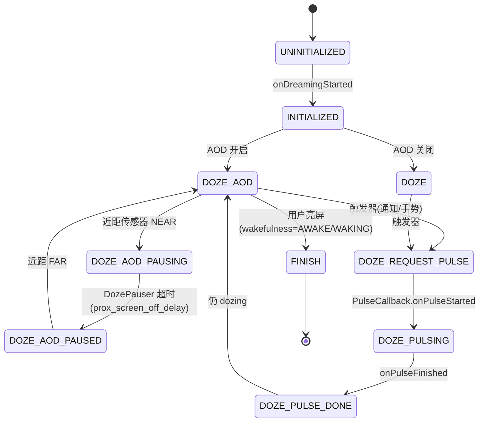
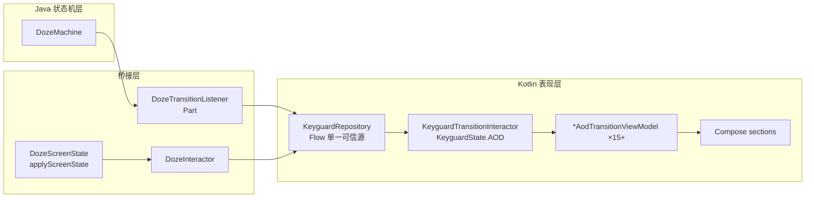
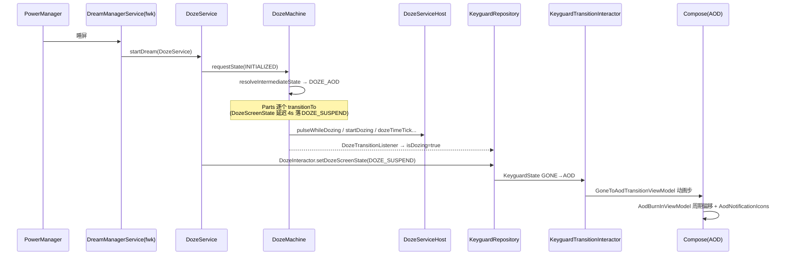

# AOD（Always-On Display）知识库

> 编写时间：2026-09-30（增量编写，讲解 → 纠偏 → 沉淀）
> 基准：AOSP `android-17.0.0_r1`（ADR 0007 冻结），对应本仓库 `SystemUI-core` 源码
> 引用约定：文中路径均为本仓库内路径；锚定到「模块内路径 + 类名 + 关键方法」，不标行号（行号随 AOSP 对齐/CONV 标记漂移）
> 实时构建状态唯一见 `docs/CURRENT_STATE.md`，本文档只记录稳定的结构事实

## 目录

- 第 1 章 · 核心 doze 子系统（`doze/` 包：状态机、DozeService/DozeMachine、触发与传感器、暂停、亮度、时间滴答）
- 第 2 章 · keyguard Compose AOD 表现层（过渡 ViewModel、BurnIn、AOD 通知、Interactor）
- 第 3 章 · 外围交叉（DozeServicePlugin、折叠屏、power 模块、framework 接口契约）
- 第 4 章 · 本项目 Gradle 落点汇总

---

# 第 1 章 · 核心 doze 子系统

## 1.1 一句话定位

SystemUI 的 AOD 在 AOSP 里叫 **doze**。它的本质是：**一个窗口化的 DreamService（`DozeService`）内部跑一个有限状态机（`DozeMachine`），在「屏幕半睡/熄屏但系统仍运行」期间编排传感器触发、脉冲（pulse）显示、屏幕状态和亮度**。AOD 是 doze 状态机里 `DOZE_AOD` 一族状态的统称。

## 1.2 启动链路：AOD 怎么被拉起来

```
用户按电源键/超时熄屏
  → framework DreamManagerService 启动当前 DozeService（经 dreams 机制，组件见 manifest）
  → DozeService#onCreate()          // setWindowless(true)；构建 DozeComponent（@DozeScope Dagger 子组件）
  → DozeService#onDreamingStarted() // mDozeMachine.requestState(INITIALIZED)；startDozing() 开始 dozing
  → DozeService#onDreamingStopped() // requestState(FINISH) 后状态机终态
```

关键事实：

- `DozeService extends DreamService implements DozeMachine.Service`（`SystemUI-core/src/com/android/systemui/doze/DozeService.java`）。它同时是 DozeMachine 对接 framework 的出口（`Service` 接口代理了 `DreamService` 的 `finish()` / `setDozeScreenState()` / `setDozeScreenBrightness()` / `wakeUp()`）。
- **Dagger 结构**：`DozeComponent` 是 DozeScope 子组件，`builder.build(this)` 传入 DozeService 实例生成 `@WrappedService DozeMachine.Service`（`doze/dagger/DozeModule.java#providesWrappedService` 会套三层装饰：亮度转发 → 屏幕状态阻断适配 ×2）。
- 插件点：`DozeService` 监听 `DozeServicePlugin`（`:SystemUI-plugin` 提供），插件可在 dreaming 期间接管 AOD 表现（`onRequestShowDoze()/onRequestHideDoze()` 回调到状态机）。

## 1.3 DozeMachine：17 态有限状态机

`doze/DozeMachine.java` 的 `State` 枚举共 17 个状态。按族分组理解：

| 族 | 状态 | 含义 |
|---|---|---|
| 生命周期 | `UNINITIALIZED` → `INITIALIZED` → `FINISH` | 机器起止 |
| 基础 doze | `DOZE` | 深睡：屏灭、只监听脉冲触发 |
| | `DOZE_SUSPEND_TRIGGERS` | 深睡且挂起触发器（如 pocket 中省传感器） |
| AOD | `DOZE_AOD` | 常显：屏 DOZE_SUSPEND、显示 UI、监听触发 |
| | `DOZE_AOD_PAUSED` / `DOZE_AOD_PAUSING` | 近距传感器挡住时的临时关屏（PAUSING 是倒计时中间态） |
| | `DOZE_AOD_DOCKED` / `DOZE_AOD_MINMODE` | 底座常显 / 小窗模式常显（醒着显示） |
| 脉冲 | `DOZE_REQUEST_PULSE` → `DOZE_PULSING` / `DOZE_PULSING_BRIGHT` / `DOZE_PULSING_WITHOUT_UI` / `DOZE_PULSING_AUTH_UI` → `DOZE_PULSE_DONE` | 通知/手势触发的短暂亮屏显示 |

三个关键派生属性（`DozeMachine.State` 上的方法）：

- `canPulse()`：哪些状态允许发起脉冲（DOZE / DOZE_AOD / PAUSED / PAUSING / DOCKED / MINMODE）
- `staysAwake()`：哪些状态要持有 wakelock（所有 pulsing 态 + DOCKED + MINMODE）
- `screenState(parameters)`：每态对应的 `Display.STATE_*`（如 `DOZE_AOD` → `STATE_DOZE_SUSPEND`，pulsing → `STATE_ON`，`DOZE` → `STATE_OFF`）

**核心运转机制**：

1. `requestState()` 收请求 → 进 `mQueuedRequests` 队列 → 持 wakelock 依次 `transitionTo()`。Part 在转换中可以**反向再入队**新状态，队列循环处理（这是状态机自我推进的方式）。
2. `transitionPolicy()` 做**前置改写**：AOD 被 App 抑制 / 省电模式下，`isAlwaysOn()` 的目标态会被降级成 `DOZE`；已处于 pausing/paused 时丢弃 `DOZE_PULSE_DONE`；`canPulse()==false` 时丢弃脉冲请求。
3. `resolveIntermediateState()` 处理两个自动推进的中间态：`INITIALIZED` 和 `DOZE_PULSE_DONE` 之后根据**唤醒状态 / 底座 / minmode / AOD 开关**自动选下一态（`DOZE_AOD_DOCKED` > `DOZE_AOD`（取决于 `AmbientDisplayConfiguration.alwaysOnEnabled`）> `DOZE`）。



## 1.4 Part 机制：状态机的「插件式」执行体

`DozeMachine.Part` 是状态机的扩展点，每个 Part 在每次状态转换时收到 `transitionTo(oldState, newState)` 回调。`DozeModule#providesDozeMachineParts` 注册 11~12 个 Part（`Flags.enableMinmode()` 时加 `DozeMinMode`）：

| Part | 职责 |
|---|---|
| `DozePauser` | `DOZE_AOD_PAUSING` 态下按 `AlwaysOnDisplayPolicy.proxScreenOffDelayMs`（默认 10s）超时推进到 PAUSED |
| `DozeFalsingManagerAdapter` | 对接 falsing（误触检测） |
| `DozeTriggers` | **触发器中枢**：传感器、通知、底座、指纹事件 → 脉冲请求（§1.5） |
| `DozeUi` | 脉冲生命周期转发到 `DozeHost.pulseWhileDozing()`；AOD 时间滴答（§1.6） |
| `DozeScreenBrightness` | 环境亮度传感器 → 决策 `Service.setDozeScreenBrightness` + dimming scrim |
| `DozeScreenState` | 把状态的 `screenState()` 落成真实显示状态；含动画/UDFPS 的延迟策略（§1.6） |
| `DozeWallpaperState` | AOD 壁纸显示/淡出（`wallpaper_visibility_timeout` 默认 60s） |
| `DozeDockHandler` | 底座事件 → DOZE_AOD_DOCKED / DOZE |
| `DozeAuthRemover` | 认证 UI 相关清理 |
| `DozeSuppressor` | 抑制条件（provisioned/power save 等） |
| `DozeTransitionListener` | 把状态机事件桥接到 Kotlin 侧（`keyguard/shared/model/DozeTransitionModel`） |
| `DozeMinMode` | min-mode UI（aflag 门控） |

`Part` 回调的保证：**只在持有 wakelock 期间被调用**（`DozeMachine#requestState` 全程持锁）。

## 1.5 DozeTriggers：脉冲是怎么被触发的

`doze/DozeTriggers.java` 的触发来源：

1. **传感器**（`DozeSensors` 内部类族，如 pickup/double-tap/tap/long-press/quick-pickup/wake-presence/udfps-long-press）→ `onSensor()` 统一入口。通用路径：**先近距检查**（在口袋则丢弃）→ 按类型分流：双击/单击 → `gentleWakeUp()`（柔和唤醒，不脉冲）；pickup → 检查 keyguard occluded 后 gentleWakeUp；udfps-long-press → 记 `mAodInterruptRunnable` 等屏亮后注入；其余 → `extendPulse()`。
2. **通知**（`DozeHost.Callback#onNotificationAlerted`）→ 检查 `pulseOnNotificationEnabled` + AOD 未抑制 → `requestPulse(PULSE_REASON_NOTIFICATION)`。
3. **底座事件**（`DockEventListener`）→ 传感器屏蔽策略调整。
4. **指纹**（侧指纹 acquisition、UDFPS 屏下脉冲分级：前两次 `PULSE_REASON_FINGERPRINT_PULSE_SHOW_AUTH_UI`，第三次升级 `SHOW_FULL_UI`）。
5. **调试 intent**：`com.android.systemui.doze.pulse`（adb 可发）。

`requestPulse()` 的决策链：已在 pulsing 时按 reason 决定是升级（→`DOZE_PULSING_BRIGHT`）、忽略还是直接切 pulsing 子态；否则置 `isPulsePending` → 近距复核 → `mMachine.requestPulse(reason)`。每一步失败都会 `tracePulseDropped` 落 `DozeLog`——**排查「AOD 不亮」类问题先看 DozeLog 的 pulse dropped 原因**。

## 1.6 屏幕状态、亮度与时间滴答

- `DozeScreenState`：转换时取 `newState.screenState(mParameters)`；进入 doze 若需要动画（`shouldDelayDisplayDozeTransition`）延迟 4s 并把屏先置 ON 再转 DOZE；UDFPS 手指按下时延迟 1.2s；关屏走 `DozeHost.prepareForGentleSleep()`（淡出 scrim 后真正切 `STATE_OFF`——**「gentle sleep」就是这里**）。每次 `applyScreenState` 同步通知 `DozeInteractor.setDozeScreenState()`（Kotlin 侧单一可信源，第 2 章讲）。
- `DozeScreenBrightness`：熄屏后由环境光传感器驱动，经 `AlwaysOnDisplayPolicy` 的 `screen_brightness_array` 映射 + `BrightnessSynchronizer` 换算，可能叠加 `dimmingScrimArray`（软件压暗 scrim，不用真改亮度）。
- `DozeUi` 的**时间滴答**：AOD 显示期间每分钟用 AlarmManager 对齐下一分钟触发 `dozeTimeTick()` → `DozeHost` → keyguard 时钟刷新。超 90s 未 tick 记 `traceMissedTick`。**AOD 时钟不走字/走字卡顿的第一排查点**。
- `AlwaysOnDisplayPolicy`（`doze/AlwaysOnDisplayPolicy.java`，`Settings.Global.ALWAYS_ON_DISPLAY_CONSTANTS` 驱动）：`prox_screen_off_delay`（默认 10s，PAUSING→PAUSED）、`prox_cooldown_*`（近距冷却）、`wallpaper_visibility_timeout`（默认 60s）、`screen_brightness_array`/`dimming_scrim_array`/`wallpaper_dimming_scrim_array`（三档环境亮度映射）。

## 1.7 第 1 章小结（本项目 Gradle 落点）

- 全部在 **`:SystemUI-core`**（AOSP SystemUI-core 源码镜像，`doze/` 包 24 文件 + `doze/dagger/` 5 文件 + `doze/util/`）。
- `DozeParameters` / `DozeScrimController` / `DozeServiceHost`（`DozeHost` 的实现）在 `statusbar/phone/`——同属 core，第 2 章细讲。
- 依赖 `AmbientDisplayConfiguration`（framework）、`MinModeManager`（17 新增）、`SceneContainerFlag`、`Flags.enableMinmode()` 等 aconfig 值，均由 SysUISdk/framework.jar/flags jar 提供。
- 与 Kotlin 侧的桥：`DozeTransitionListener`（→ `DozeTransitionModel`）、`DozeInteractor.setDozeScreenState()`（→ `DozeScreenStateModel`）。

---

# 第 2 章 · keyguard Compose AOD 表现层

## 2.1 总览：双层架构

AOD 的「大脑」是第 1 章的 Java 状态机（doze 包），「脸」是 keyguard 的 Kotlin/Compose 表现层。两层之间有两条桥：



关键设计：**`DozeStateModel`（`keyguard/shared/model/DozeStateModel.kt`）是 `DozeMachine.State` 的 1:1 Kotlin 镜像枚举**（17 态完全对应），附带 `isPulsing()` / `isDozing()` / `isDocked()` 纯函数。Java 世界不直接进 Compose；一切经 Repository 的 Flow 转一道。

## 2.2 桥接层三个入口

| 入口 | 数据流 |
|---|---|
| `DozeTransitionListener`（Part，`doze/DozeTransitionListener.kt`） | 每次状态转换广播给 `DozeTransitionCallback` 集合 → 上层（`KeyguardRepository`）把 `DozeMachine.State` 映射成 `DozeStateModel`，存 `dozeTransitionModel` / `isDozing` |
| `DozeInteractor.setDozeScreenState()`（`keyguard/domain/interactor/DozeInteractor.kt`） | `DozeScreenState` 每次落显示状态时同步调用 → `PowerRepository.dozeScreenState: MutableStateFlow<DozeScreenStateModel>`（ON/OFF/DOZE/DOZE_SUSPEND…） |
| `DozeInteractor.dozeTimeTick()` / `setAodAvailable()` / `setLastTapToWakePosition()` | 时钟刷新、AOD 可用性、双击唤醒位置等杂项桥 |

`DozeInteractor.canDozeFromCurrentScene()` 是 17 新增的 SceneContainer 门控：**只有当前 scene 是 `Scenes.Lockscreen` 才允许进入 doze**，SceneContainer flag 未启用时直接 false。

## 2.3 Keyguard 状态机：AOD 是 `KeyguardState.AOD`

Kotlin 侧有自己的 keyguard 状态机（`KeyguardState`：GONE/LOCKSCREEN/AOD/OCCLUDED/PRIMARY_BOUNCER/DREAMING…），AOD 只是其中一个节点。每个节点配一对 Interactor：

- **入边**：`ToAodEndStateTransitionInteractor` / `ToAodFoldTransitionInteractor` 等（谁允许进 AOD、什么条件下进）
- **出边**：`FromAodTransitionInteractor`（`keyguard/domain/interactor/FromAodTransitionInteractor.kt`）——**这是 AOD 唤醒路径的决策中枢**

`FromAodTransitionInteractor#listenForAodToAwake` 订阅 `powerInteractor.detailedWakefulness`（**最早的唤醒信号**，比 keyguard 状态流更早），醒来后按优先级决策：

1. `canWakeDirectlyToGone`（无锁屏/可信环境）→ **AOD → GONE**（直接解锁进桌面）
2. communal 自动打开设置 → AOD → Communal（Hub）
3. 正常 → **AOD → LOCKSCREEN**
4. occluded（如来电）→ AOD → OCCLUDED

配套出边 ViewModel：`AodToLockscreenTransitionViewModel`、`AodToGoneTransitionViewModel`、`AodToOccludedTransitionViewModel`、`AodToPrimaryBouncerTransitionViewModel`、`AodToGlanceableHubTransitionViewModel`、`DreamingToAodTransitionViewModel`、`PrimaryBouncerToAodTransitionViewModel`、`AlternateBouncerToAodTransitionViewModel`、`GlanceableHubToAodTransitionViewModel`、`LockscreenToAodTransitionViewModel`、`GoneToAodTransitionViewModel`、`OccludedToAodTransitionViewModel` 等 15+ 个。

## 2.4 TransitionViewModel：把「边」拆成「视图级动画步」

模式统一（以 `GoneToAodTransitionViewModel` 为例）：

1. `KeyguardTransitionAnimationFlow.setup(duration, edge)` 声明「哪条边、多长时间」
2. 每个视图关心一个**离散动画步**，用 `sharedFlowWithState(startTime, duration, onStep, onFinish, interpolator)` 或 `immediatelyTransitionTo` 拆出来
3. Compose 视图各自收集自己关心的 Flow

Gone→AOD 的分解（`FromGoneTransitionInteractor.TO_AOD_DURATION` 总长，内部再错位）：

| 视图 | 动画 | 参数 |
|---|---|---|
| AOD 内容从顶部进入 | y 平移 | 600ms 起 / 500ms，EMPHASIZED_DECELERATE |
| 折叠屏特殊路径 | x 平移（从侧边） | 500ms 起 / 600ms；**仅当 `lastSleepReason == FOLD`** |
| 通知 alpha | 淡出再回 1f | 200ms（`onFinish=1f` 保证 HUN 能在 AOD 上显示） |
| 内容整体 alpha | 淡入 | 700ms 起 / 400ms |
| UDFPS 设备入口图标 | 立即 0f 或 1f | 按 `isUdfpsEnrolledAndEnabled` |

特殊案例：**折叠原因睡屏走 `enterFromSideTranslationX`**，其他原因走 `enterFromTopTranslationY`——FoldAodAnimationController / `ToAodFoldTransitionInteractor` 与这里联动（第 3 章）。

## 2.5 BurnIn 防烧屏

两层协作：

- **domain**：`BurnInInteractor.burnIn(xDimen, yDimen)` 用 `R.dimen.burn_in_prevention_offset_x/y` 生成周期性偏移 + scale（`BurnInModel`）
- **ui**：`AodBurnInViewModel.movement` 把**烧屏偏移**与**过渡动画偏移**合成（进入 AOD 过程中插值 0→1，burn-in 权重渐显；大时钟 scale-only 策略按 clock config 切换）
- UI 侧通过 `updateBurnInParams(BurnInParameters(topInset, minViewY, ...))` 回传约束（元素不能移入状态栏区域，`minViewY < topInset` 会被纠正并记 warning）
- Compose 消费端是 `BurnInMovementState`（`HydratedActivatable`，把 Flow hydrate 成 `Offset`/`BurnInScaleViewModel` composable state）；布局锚点是 `AodBurnInLayer` / `AodBurnInSection`（`keyguard/ui/view/layout/sections/`）

## 2.6 AOD 通知与调光

- **通知**：`AodNotificationIconsSection` / `AodPromotedNotificationAreaElementProvider`（`compose/features/`）——AOD 上只显示图标行和「置顶通知区」，内容由 `NotificationWakeUpCoordinator` 在脉冲期间驱动。Gone→AOD 过渡里通知 alpha 的 `onFinish=1f` 就是为了让 HUN 可见。
- **调光**：`AodDimRepository`（data）+ `AodDimInteractor`（domain，`dimAmount` / `wallpaperDimAmount` 两个值）。写入方是 `DozeHost.setAodDimmingScrim()` / `setAodWallpaperDimmingScrim()` 的默认实现——由 `DozeServiceHost`（`DozeHost` 的实现，`statusbar/phone/DozeServiceHost.java`）接到 `DozeScrimController` / `ScrimController` 转成 scrim opacity。gentleWakeUp 时 `setAodDimmingScrim(1f)` 先画黑再唤醒。

## 2.7 DozeServiceHost：DozeHost 接口的 SystemUI 实现

`statusbar/phone/DozeServiceHost.java` 是第 1 章所有 `DozeHost.xxx` 调用的落点：

| DozeHost 方法 | 落点 |
|---|---|
| `pulseWhileDozing(callback, reason)` | 脉冲 UI：经 `DozeScrimController` 控 scrim、`NotificationWakeUpCoordinator` 通知唤醒、`HeadsUpManager` 抬显，回调驱动状态机 DOZE_REQUEST_PULSE→DOZE_PULSING |
| `extendPulse(reason)` | 延长脉冲（通知类脉冲双击延长显示） |
| `prepareForGentleSleep(cb)` | 关屏前淡出，cb 在屏真正黑后执行 |
| `startDozing()/stopDozing()` | `SysuiStatusBarStateController` 切 StatusBarState.KEYGUARD、通知 window |
| `dozeTimeTick()` | → `DozeInteractor.dozeTimeTick()` → KeyguardRepository 刷新时钟 |
| `setAodDimmingScrim()` 等 | → `AodDimInteractor`（§2.6） |

它还持有 `mWakeLockScreenPerformsAuth`（`persist.sysui.wake_performs_auth`，亮屏即触发认证的开关）。

## 2.8 一条完整时序：按电源键进 AOD



## 2.9 第 2 章小结（本项目 Gradle 落点）

- 全部在 **`:SystemUI-core`**：`keyguard/domain/interactor/`（DozeInteractor/AodDimInteractor/From*ToAod 全家）、`keyguard/data/repository/`（AodDimRepository、KeyguardRepository 的 doze 字段）、`keyguard/shared/model/`（DozeStateModel/DozeTransitionModel）、`keyguard/ui/viewmodel/`（15+ AOD 过渡 VM + AodBurnInViewModel）、`keyguard/ui/view/layout/sections/`（AodBurnIn*/AodNotification*）、`compose/features/`（element providers）、`statusbar/phone/`（DozeServiceHost/DozeScrimController/DozeParameters/ScrimState）。
- 依赖面：`SceneContainerFlag`、`Flags.wakefulnessForAnimations()`、`KeyguardWmStateRefactor` 等 aconfig 门控大量分支——**读这些文件时先确认 flag 状态，否则两条代码路径会互相干扰理解**。
- AOD 表现层同时被 legacy（非 SceneContainer）和 scene 两条路径消费（如 `setup`/`setupWithoutSceneContainer` 双注册），这是 AOSP 17 过渡期特征。

---

# 第 3 章 · 外围交叉

## 3.1 Framework 接口契约（上游，不在本仓库）

AOD/doze 是 SystemUI 与 framework 的协作体。SystemUI 侧的边界点：

| 边界 | SystemUI 侧 | Framework 侧（契约，不展开实现） |
|---|---|---|
| doze 服务入口 | `DozeService`（manifest 注册为 `BIND_DREAM_SERVICE` 的 dream，`SystemUI-application/src/main/AndroidManifest.xml:1170`） | `DreamManagerService`：framework 资源 `config_dozeComponent` 指向 `com.android.systemui/.doze.DozeService`；睡屏/启动 doze dream 时 bind 它，回调 `onDreamingStarted/Stopped` |
| 显示状态 | `DozeMachine.Service.setDozeScreenState(state)`（DOZE/DOZE_SUSPEND/OFF/ON） | `DreamService.setDozeScreenState` → DisplayManager 设置 display power mode；AOD 的核心显示能力（`doze_display_state_supported` 等设备 overlay） |
| 亮度 | `Service.setDozeScreenBrightness(float)`（后台线程执行） | DreamService → DisplayManager 亮度流 |
| 唤醒 | `DozeService#requestWakeUp(reason)` → `PowerManager.wakeUp(uptime, reason, "NODOZE…")` | PowerManagerService：WAKE_REASON 映射见 `DozeLog.getPowerManagerWakeReason` |
| 配置读取 | `AmbientDisplayConfiguration`（`alwaysOnEnabled`、`pulseOnNotificationEnabled`…按 user 读 `Settings.Secure.DOZE_*`） | framework `AmbientDisplayConfiguration`（@hide，SysUISdk 提供）；`AlwaysOnDisplayPolicy` 读 `Settings.Global.ALWAYS_ON_DISPLAY_CONSTANTS` |
| AOD 抑制 | `DozeHost.isAlwaysOnSuppressed()` | App 可通过 `DreamManagerService` API 抑制 AOD（如 pocket detection、隐私模式） |

## 3.2 DozeServicePlugin：AOD 的插件接管点

`SystemUI-plugin/src/com/android/systemui/plugins/DozeServicePlugin.java`——极简接口（ACTION `com.android.systemui.action.PLUGIN_DOZE`，version 1）：

```java
void onDreamingStarted() / onDreamingStopped() / setDozeRequester(RequestDoze)
// RequestDoze: onRequestShowDoze() → DozeMachine.DOZE_AOD；onRequestHideDoze() → DOZE
```

`DozeService` 作为 `PluginListener<DozeServicePlugin>` 注册（不允许 multiple）。OEM 可用插件在 doze 期间**完全接管 AOD 渲染**（把 SystemUI 默认 AOD UI 换成自己的），通过 `RequestDoze` 反向控制状态机。配套 `SystemUI-plugin/src/com/android/systemui/plugins/statusbar/DozeParameters.java` 是插件可读 doze 参数的只读接口（实现者是 `statusbar/phone/DozeParameters`）。

## 3.3 折叠屏：FoldAodAnimationController

`SystemUI-core/src/com/android/systemui/unfold/FoldAodAnimationController.kt`（`@SysUIUnfoldScope`）：

- **触发条件**：AOD 开启 + `lastSleepReason == GO_TO_SLEEP_REASON_DEVICE_FOLD` + 动画缩放非 0
- 实现 `ScreenOffAnimation` 接口（被 `ScreenOffAnimationController` 编排进关屏动画链）+ `WakefulnessLifecycle.Observer`
- 折叠合上到外屏时，由 `ShadeFoldAnimator.startFoldToAodAnimation()` 播特殊 AOD 入场动画；与 `ToAodFoldTransitionInteractor` 双向联动（第 2 章 GoneToAod 的 `enterFromSideTranslationX` 只对 FOLD 原因生效就是这里的约定）
- 内置 `FoldToAodLatencyTracker` + `LatencyTracker` 上报折叠入 AOD 延迟

注意它属于 `:SystemUI-core`（unfold 源已并入 core），但 scope 是 SysUIUnfoldComponent 的子 scope。

## 3.4 Power 模块消费：`DozeScreenStateModel`

`SystemUI-core/src/com/android/systemui/power/shared/model/DozeScreenStateModel.kt` 是 `Display.STATE_*` 的 doze 精简枚举（UNKNOWN/OFF/ON/DOZE/DOZE_SUSPEND/VR/ON_SUSPEND），由 `PowerRepository.dozeScreenState: MutableStateFlow` 持有。消费方：PowerInteractor（电量/唤醒状态全家）、第 2 章各 TransitionViewModel（拿显示状态判断动画路径）。**它是 Java 显示状态进入 Kotlin power 域的口岸**。

## 3.5 配置资源面

| 资源 | 位置 | 作用 |
|---|---|---|
| `doze_*` 开关族（`doze_display_state_supported`、`doze_pulse_on_significant_motion`、`doze_proximity_check_before_pulse`、`doze_selectively_register_prox`、`doze_single_tap_uses_prox`…） | `SystemUI-res/res/values/config.xml:190+` | 设备能力声明，OEM overlay 重载；驱动 `DozeParameters`/`DozeSensors` 行为 |
| `burn_in_prevention_offset_x/y(_clock)`、`default_burn_in_prevention_offset` | `SystemUI-res/res/values/dimens.xml:1125+` | BurnIn 偏移量（8dp/50dp/42dp） |
| `keyguard_enter_from_top/side_translation_*` | dimens | Gone→AOD 入场平移量 |
| `config_screenBrightnessDim(Float)` | config.xml | 关屏动画压暗亮度 |
| `Settings.Secure.DOZE_ALWAYS_ON`、`DOZE_ON_CHARGE`… | framework Settings | `DozeParameters`（TunerService 监听）+ `AmbientDisplayConfiguration` |

## 3.6 相关 aconfig flags

AOD 代码被这些 flag 分叉（读代码先查 flag）：

- `Flags.enableMinmode()` → `DOZE_AOD_MINMODE` 状态与 `DozeMinMode` Part
- `SceneContainerFlag` → scene/legacy 双路径（`DozeInteractor.canDozeFromCurrentScene`、ViewModel 双注册、DozeScreenState 关屏 gentle sleep 与否）
- `Flags.wakefulnessForAnimations()` + `KeyguardWmStateRefactor` → `FromAodTransitionInteractor` 唤醒路径决策
- `DisplayComponentRepositoryFlag`（eager init）等

# 第 4 章 · 本项目 Gradle 落点汇总

## 4.1 模块归属表

| 内容 | Gradle 模块 | 仓库路径 |
|---|---|---|
| doze 状态机 + Parts + dagger | `:SystemUI-core` | `SystemUI-core/src/com/android/systemui/doze/` |
| DozeHost 实现 / DozeScrimController / DozeParameters / ScrimState | `:SystemUI-core` | `SystemUI-core/src/com/android/systemui/statusbar/phone/` |
| Kotlin 桥 + keyguard 表现层（Interactor/Repository/ViewModel/Sections） | `:SystemUI-core` | `SystemUI-core/src/com/android/systemui/keyguard/`、`compose/features/` |
| AOD 通知/置顶区 Compose element providers | `:SystemUI-core` | `SystemUI-core/compose/features/…` |
| FoldAodAnimationController | `:SystemUI-core`（unfold 源并入 core，scope 仍 SysUIUnfold） | `SystemUI-core/src/com/android/systemui/unfold/` |
| DozeServicePlugin / DozeParameters(插件接口) | `:SystemUI-plugin` | `SystemUI-plugin/src/com/android/systemui/plugins/` |
| DozeService manifest 声明 | `:SystemUI-application` | `SystemUI-application/src/main/AndroidManifest.xml:1170` |
| doze/burn-in 资源 | `:SystemUI-res`（R=`com.android.systemui.res`） | `SystemUI-res/res/values/{config,dimens}.xml` |
| power 域 DozeScreenStateModel | `:SystemUI-core` | `…/power/shared/model/DozeScreenStateModel.kt` |

## 4.2 构建依赖要点

- framework 侧契约（`DreamService`、`AmbientDisplayConfiguration`（@hide）、`PowerManager` doze API、`Display.STATE_*`、`DeviceStateManager`）由 **SysUISdk + framework.jar** 提供（规则 F：framework 代码严禁源码复制）
- aconfig flags（`Flags.enableMinmode`、`wakefulnessForAnimations`、notification flags 等）由 **flags jar**（`libs/` 根，JavaCompile classpath 位于 framework.jar 之前）提供
- `SceneContainerFlag`/`KeyguardWmStateRefactor` 属 systemui 自有 flags
- 本项目特有注意点：`DozeService` 通过 `DefaultServiceBinder` 进 Dagger 图、`DozeHost` 绑定在 `ReferenceSystemUIModule`——两处都是 core 源码内的既有接缝，迁移时无额外处理

## 4.3 调试与排查速查

```bash
# doze 状态机与全部 Parts 的现场状态
adb shell dumpsys activity service com.android.systemui/.doze.DozeService

# 手动触发一次脉冲（AOD 应亮一下）
adb shell am broadcast -a com.android.systemui.doze.pulse com.android.systemui

# 开关 AOD
adb shell settings put secure doze_always_on 1

# AOD 策略常量（近距关屏延迟/亮度映射等）
adb shell settings get global always_on_display_constants
```

排查心法：**「AOD 不亮」先看 DozeLog 的 `tracePulseDropped` 原因链；「时钟不走」看 DozeUi time tick 与 `traceMissedTick`；「进 AOD 闪黑/闪白」看 DozeScreenState 延迟策略与 `debug.force_no_blanking`；「折叠动画不对」看 FoldAodAnimationController 三条件与 SceneContainerFlag 状态。**
