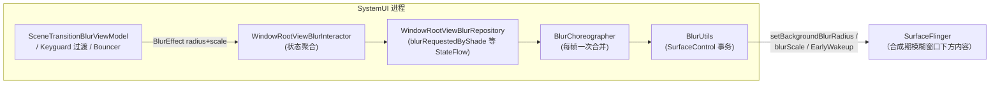

# SystemUI 高斯模糊（Blur）实现知识库

> 编写时间：2026-09-30
> 基准：AOSP `android-17.0.0_r1`（ADR 0007 冻结），对应本仓库 `SystemUI-core` 源码
> 引用约定：文中路径均为本仓库内路径；锚定到「路径 + 类#方法」，不标行号；源码摘录均已验证
> 实时构建状态唯一见 `docs/CURRENT_STATE.md`。姊妹篇：[AOD](./2026-09-30-aod-knowledge-base.md)（AOD 壁纸模糊半径折半）、通知（shade 内容模糊）

## 1. 一句话定位

SystemUI 的「高斯模糊」是**跨窗口背景模糊**（cross-window background blur）：由 **SurfaceFlinger 在合成时对窗口下方内容做模糊**，SystemUI 只负责按帧把「模糊半径 + 缩放」写进 SurfaceControl 事务。这不是 App 内的 RenderEffect/RenderScript 模糊，而是窗口级 GPU 合成效果。



## 2. 三层架构

| 层 | 类 | 职责 |
|---|---|---|
| 状态层 | `window/data/repository/WindowRootViewBlurRepository(Impl).kt`、`window/domain/interactor/WindowRootViewBlurInteractor.kt` | 「要不要模糊/多大」的状态流 |
| 节拍层 | `window/ui/BlurChoreographer.kt` | 每帧只应用一次模糊变化（Choreographer 合并） |
| 执行层 | `statusbar/BlurUtils.kt` | SurfaceControl 事务 + SurfaceFlinger early-wakeup 管理 |

## 3. BlurUtils：底层执行全走查

`statusbar/BlurUtils.kt`（`@SysUISingleton`，`Dumpable`）——唯一的「真模糊」出口。

### 3.1 半径换算（ratio ↔ px）

```kotlin
// BlurUtils（摘录）
val minBlurRadius = resources.getDimensionPixelSize(R.dimen.min_window_blur_radius).toFloat()  // 1px
val maxBlurRadius =
    if (Flags.notificationShadeBlur()) blurConfig.maxBlurRadiusPx        // BlurConfig 注入
    else resources.getDimensionPixelSize(R.dimen.max_window_blur_radius).toFloat()  // 23px

fun blurRadiusOfRatio(ratio: Float): Float = MathUtils.lerp(minBlurRadius, maxBlurRadius, ratio)
fun blurRadiusOfRatioForAod(ratio: Float): Float =
    MathUtils.lerp(minBlurRadius, maxBlurRadius / 2, ratio)   // AOD 壁纸模糊用一半半径
fun ratioOfBlurRadius(blur: Float): Float = MathUtils.map(minBlurRadius, maxBlurRadius, 0f, 1f, blur)
```

**约定**：UI 侧动画传 0→1 的 ratio，`BlurUtils` 负责换算像素半径；AOD 场景半径上限折半。

### 3.2 applyBlur：一帧的完整事务

```kotlin
// BlurUtils#applyBlur（核心摘录）
fun applyBlur(viewRootImpl: ViewRootImpl?, radius: Int, opaque: Boolean, scale: Float = 1.0f) {
    updateTransactionApplier(viewRootImpl)          // SyncRtSurfaceTransactionApplier 绑定 root
    val builder = SyncRtSurfaceTransactionApplier.SurfaceParams.Builder(viewRootImpl.surfaceControl)
    if (shouldBlur(radius)) {
        builder.withBackgroundBlurRadius(radius)     // ← 真正的模糊半径
        builder.withBackgroundBlurScale(scale)       // ← 模糊缩放
        if (lastAppliedBlur == 0 && radius != 0) {
            viewRootImpl.notifyRendererForGpuLoadUp("applyBlur")   // 预热 GPU
            if (!earlyWakeupEnabled) earlyWakeupStartNextFrame(builder, ...)
        }
        if (earlyWakeupEnabled && lastAppliedBlur != 0 && radius == 0
                && !persistentEarlyWakeupRequired) {
            earlyWakeupEndNextFrame(builder, ...)    // 模糊归零 → 收回 early wakeup
        }
        lastAppliedBlur = radius
    }
    builder.withOpaque(opaque)
    transactionApplier.scheduleApply(builder.build())  // 随下一帧渲染同步提交
}
```

### 3.3 EarlyWakeup：SurfaceFlinger 工作时长开关

模糊首帧是 GPU 负载尖峰。`BlurUtils` 用 `EarlyWakeupInfo`（`setEarlyWakeupStart/End`）让 SurfaceFlinger 切到**更长工作时长**防止掉帧：

- `immediateEarlyWakeupStart/End`：同步事务立即切换（模糊从 0 变非 0 的瞬间用，避免首帧掉帧）
- `earlyWakeupStartNextFrame/EndNextFrame`：搭车下一帧事务切换
- `persistentEarlyWakeupRequired`：CUJ 期间持续保持（连续模糊动画场景，由 `BlurChoreographer#setPersistentEarlyWakeup` 控制）

### 3.4 shouldBlur / supportsBlursOnWindows：降级判定链

```kotlin
// BlurUtils（摘录）
private fun shouldBlur(radius: Int): Boolean {
    return supportsBlursOnWindows() ||
        ((Flags.notificationShadeBlur() || Flags.bouncerUiRevamp()) &&
            supportsBlursOnWindowsBase() && lastAppliedBlur > 0 && radius == 0)  // 只放行「归零」
}
open fun supportsBlursOnWindows(): Boolean =
    supportsBlursOnWindowsBase() && crossWindowBlurListeners.isCrossWindowBlurEnabled
private fun supportsBlursOnWindowsBase(): Boolean =
    CROSS_WINDOW_BLUR_SUPPORTED &&               // framework 编译期能力
    ActivityManager.isHighEndGfx() &&            // 高端 GPU 白名单
    !SystemProperties.getBoolean("persist.sysui.disableBlur", false)  // 测试总开关
```

四层降级：**framework 能力 → 高端 GPU → 系统属性总开关 → 运行时设置/省电**（`CrossWindowBlurListeners.isCrossWindowBlurEnabled` 会随「窗口模糊」设置与省电模式动态关闭）。

## 4. BlurChoreographer：每帧一次的节拍器

`window/ui/BlurChoreographer.kt`——接口 + 两个实现：

### 4.1 DefaultBlurChoreographer

```kotlin
// DefaultBlurChoreographer（核心摘录）
private val newFrameCallback = Choreographer.FrameCallback {
    wasUpdateScheduledForThisFrame = false
    blurUtils.applyBlur(rootView.viewRootImpl, lastScheduledBlurEffect.radius.toInt(),
                        false, lastScheduledBlurEffect.scale)
    blurAppliedListener?.invoke(lastScheduledBlurEffect)   // 应用后回调（view 层确认）
}
override fun applyBlur(blurEffect: BlurEffect) {
    // 同帧多次请求只保留最后一次（wasUpdateScheduledForThisFrame 合并）
    if (wasUpdateScheduledForThisFrame) {
        if (lastScheduledBlurEffect != blurEffect) lastScheduledBlurEffect = blurEffect
    } else { ... postFrameCallback ... }
}
```

- **合并语义**：一帧内 N 次模糊请求只落最后一次（防抖）
- `setPersistentEarlyWakeup(persistent)`：CUJ 开始/结束时开关 SurfaceFlinger 长工作时长
- `registerOnBlurAppliedListener`：模糊实际落帧后回调（view 层用它同步 UI 状态）
- `NoopBlurChoreographer`：空实现（不支持模糊的 SysUI 变体）

### 4.2 Dagger 装配

`window/dagger/WindowRootViewBlurModule.kt`（支持模糊的变体装这个，绑定 `WindowRootViewBlurRepositoryImpl`）与 `WindowRootViewBlurNotSupportedModule.kt`（不支持的变体装 Noop）——**同一套代码两个 Dagger 模块切变体**。`SceneTransitionBlurViewModel` 注入 `@Named("ShadeWindowBlurChoreographer")` 的 choreographer（shade 窗口专属实例）。

## 5. 状态层

### 5.1 BlurEffect（值对象）

```kotlin
// window/shared/model/BlurEffect.kt
data class BlurEffect(val radius: Float, val scale: Float = 1.0f)  // radius=px, scale∈[0,1]
```

### 5.2 WindowRootViewBlurRepository

`window/data/repository/WindowRootViewBlurRepository.kt`（`@SysUISingleton`）：

| 状态 | 语义 |
|---|---|
| `blurRequestedByShade: MutableStateFlow<Float>` | shade 请求的模糊量 |
| `scaleRequestedByShade: MutableStateFlow<Float>` | shade 请求的模糊缩放 |
| `isBlurSupported: StateFlow<Boolean>` | 设置开关 + 省电模式合成（`isBlurAllowed() && value`） |
| `trackingShadeMotion` | 正跟踪 shade 手势（预热 early wakeup 用） |
| `blurAppliedListener` | 落帧确认回调 |

测试开关：`persist.sysui.disableBlur`（`isDisableBlurSysPropSet`）。

### 5.3 WindowRootViewBlurInteractor

`window/domain/interactor/WindowRootViewBlurInteractor.kt`——聚合 keyguard/bouncer/communal 的模糊需求。bouncer 判定是**双源合成**（源码注释明确）：

```kotlin
// primaryBouncerShowing 变化早，模糊由过渡 fraction 协调，二者取或
combine(keyguardInteractor.primaryBouncerShowing,
        keyguardTransitionInteractor.transitionValue(Overlays.Bouncer, PRIMARY_BOUNCER).map { it > 0f })
    ) { bouncerShowing, bouncerTransitionInProgress -> bouncerShowing || bouncerTransitionInProgress }
```

## 6. 消费场景全表

| 场景 | 入口 | 机制 |
|---|---|---|
| **Scene 过渡**（shade/quick-settings/锁屏场景切换） | `scene/ui/viewmodel/SceneTransitionBlurViewModel.kt` | 注入 `@Named("ShadeWindowBlurChoreographer")`；过渡进度 → `BlurEffect(radius, scale)`；CUJ 期间 `setPersistentEarlyWakeup(true)` |
| **Keyguard/GlanceableHub 过渡** | `keyguard/ui/transitions/GlanceableHubBlurProvider.kt` + `BlurConfig.kt` | `exitBlurRadius/enterBlurRadius` 两个 Flow 按过渡 fraction `lerp(max, min)`；编辑模式保持 min；`GlanceableHubBlurComponent.kt`（dagger） |
| **Bouncer**（密码屏） | `bouncer/ui/viewmodel/`（`BouncerOverlayContentViewModel` 等）+ `bouncerUiRevamp` flag | `Flags.bouncerUiRevamp()` 门控 `BlurConfig` 半径路径（§3.4） |
| **AOD 壁纸模糊** | [AOD 知识库](./2026-09-30-aod-knowledge-base.md) §2.6 | `blurRadiusOfRatioForAod`——**半径上限折半** |
| **电源菜单** | `globalactions/GlobalActionsDialogLite` / `GlobalActionsLayout` | `global_actions_blur_radius`（34dp） |
| **音量对话框** | volume 相关 | `volume_dialog_background_blur_radius`（本仓库 overlay 值 0dp=关闭） |
| **桌面效果 AV 快捷开关**（17 新） | `statusbar/quickactions/av/`（`BlurDrillInViewModel`/`BlurButtonViewModel`/`DesktopEffectInteractor`） | 「摄像头模糊」等桌面效果的分级开关（`BlurLevel.OFF` 等），Compose UI（`BlurDrillIn.kt`） |
| **Dream overlay / 指纹图标 / 回退手势条** 等 | `dreams/`、`keyguard/ui/binder/` 等零散 | 局部视图模糊/背景衔接 |

## 7. 半径资源约定（`SystemUI-res/res/values/dimens.xml`）

| 资源 | 值 | 用途 |
|---|---|---|
| `min_window_blur_radius` | 1px | ratio→px 换算下限 |
| `max_window_blur_radius` | 23px | 非 flag 路径的上限（状态栏窗口/电源菜单） |
| `max_shade_content_blur_radius` | `@dimen/max_window_blur_radius` | shade 内容（通知/footer/shelf）模糊 |
| `max_shade_window_blur_radius` | 34dp | shade 窗口背后的模糊 |
| `global_actions_blur_radius` | 34dp | 电源菜单 |
| `BlurConfig`（keyguard 路径） | 由各 SysUI 变体 Dagger 提供（无模糊变体为 0/0） | `Flags.notificationShadeBlur()` 时取代 dimens |

## 8. framework 契约（上游，不展开实现）

| 边界 | SystemUI 侧 | Framework 侧 |
|---|---|---|
| 模糊执行 | `SyncRtSurfaceTransactionApplier` + `SurfaceParams.Builder.withBackgroundBlurRadius/Scale` | `SurfaceControl.Transaction.setBackgroundBlurRadius`（SurfaceFlinger 合成期模糊） |
| 能力/开关 | `CrossWindowBlurListeners.isCrossWindowBlurEnabled` | 「窗口模糊」用户设置、省电模式、设备能力（`CROSS_WINDOW_BLUR_SUPPORTED`） |
| GPU 提速 | `EarlyWakeupInfo` + `setEarlyWakeupStart/End` | SurfaceFlinger 切换工作时长 |
| 渲染预热 | `ViewRootImpl.notifyRendererForGpuLoadUp` | HWUI 渲染线程预热 |

## 9. 性能与降级设计

1. **设备降级**：`isHighEndGfx()` 白名单外直接无模糊（`supportsBlursOnWindowsBase` false）
2. **运行时降级**：设置关闭/省电模式 → `CrossWindowBlurListeners` 回调关 `isBlurSupported` → repository StateFlow 通知 UI 改用不模糊表现
3. **测试降级**：`persist.sysui.disableBlur` 全局灭
4. **掉帧防护**：模糊首帧 GPU 预热 + early wakeup 长工作时长；CUJ 全程 persistent early wakeup
5. **每帧一事务**：`BlurChoreographer` 合并同帧多次变更；`SyncRtSurfaceTransactionApplier` 与渲染帧同步提交

## 10. 本项目 Gradle 落点与调试

- 全部 `:SystemUI-core`：`statusbar/BlurUtils.kt`、`window/`（repository/interactor/ui/logging/dagger 全套）、`keyguard/ui/transitions/{BlurConfig,GlanceableHubBlurProvider}.kt`、`scene/ui/viewmodel/SceneTransitionBlurViewModel.kt`、`statusbar/quickactions/av/`、`bouncer/ui/`
- framework 能力（`CrossWindowBlurListeners`、`SurfaceControl` 事务、`EarlyWakeupInfo`）由 SysUISdk + framework.jar 提供（规则 F）
- flags：`Flags.notificationShadeBlur()`（shade 模糊新路径，改用 `BlurConfig`）、`Flags.bouncerUiRevamp()`（bouncer 模糊）；无模糊的 SysUI 变体装 `WindowRootViewBlurNotSupportedModule`
- **dump**：`BlurUtils` 注册了 Dumpable（`dumpManager.registerDumpable(this)`），`adb shell dumpsys activity service com.android.systemui/.SystemUIService BlurUtils` 可看 `minBlurRadius/maxBlurRadius/lastAppliedBlur/earlyWakeup` 状态
- **调试开关**：`adb shell setprop persist.sysui.disableBlur true`（灭全部模糊，测布局/性能）
- 排查「模糊没生效」：① 设备 `isHighEndGfx` ② 设置/省电（`CrossWindowBlurListeners`）③ flag 状态（`notificationShadeBlur`/`bouncerUiRevamp`）④ `BlurUtils` dump 的 `lastAppliedBlur` ⑤ Trace（`windowBlur` track 的 `appliedBlurRadius`）
