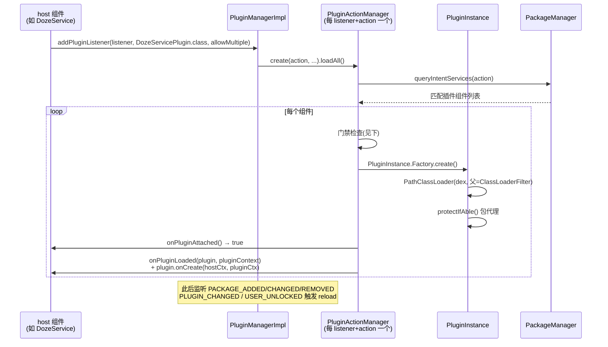

# SystemUI 插件化体系与插件定义方案

> 编写时间：2026-09-30（讲解 → 纠偏 → 沉淀）
> 基准：AOSP `android-17.0.0_r1`（ADR 0007 冻结），对应本仓库源码
> 引用约定：文中路径均为本仓库内路径；锚定到「模块内路径 + 类名 + 关键方法」，不标行号
> 实时构建状态唯一见 `docs/CURRENT_STATE.md`

## 目录

- 第 1 章 · 体系全景（四模块、三角色）
- 第 2 章 · 加载引擎（发现、门禁、类加载隔离、生命周期、熔断）
- 第 3 章 · 版本与依赖协议（注解 ABI 管理、崩溃隔离代理、依赖注入）
- 第 4 章 · 安全模型总结
- 第 5 章 · 定义插件完整方案（host 侧 + 实现侧 + 现有接口全景）
- 第 6 章 · 本项目 Gradle 落点与差异

---

# 第 1 章 · 体系全景

**角色模型**：插件是**独立 APK**，里面声明一个「伪 service」（不需要真是 Service，只是借 PackageManager 的 intent-filter 机制做发现）。SystemUI 进程按 intent action 查到它，把它的 dex **动态加载进自己的进程**执行。接口契约类（Plugin 体系）由 host 进程通过 classloader 共享给插件，插件 APK 不打包这些类。

**代码分布**（全部在本仓库）：

| 模块 | 内容 | 角色 |
|---|---|---|
| `:SystemUI-plugin-core` | `Plugin`/`PluginListener`/`PluginManager`/`PluginFragment`/`PluginLifecycleManager`/`PluginWrapper` + `annotations/`（6 个注解） | **运行时 API**：插件和 host 共同依赖的最小契约 |
| `:SystemUI-plugin` | 30+ 个具体插件接口：`QS`/`QSFactory`/`QSTile`、`VolumeDialog`/`VolumeDialogController`、`OverlayPlugin`、`ToastPlugin`、`FalsingPlugin`、`SensorManagerPlugin`、`DozeServicePlugin`、`GlobalActionsPanelPlugin`、`ClockProviderPlugin`（锁屏时钟）、`LockscreenElementProvider`（Compose 锁屏元素）、`BcSmartspaceDataPlugin`… | **接口库**：定义「SystemUI 的哪些部位可被插件替换」 |
| `:SystemUI-shared` 的 `shared/plugins/` | `PluginManagerImpl`、`PluginActionManager`、`PluginInstance`（+Factory）、`VersionInfo`/`VersionChecker`、`PluginEnabler`、`PluginPrefs`、`PackageConfig`、`PluginEnvironment` | **加载引擎**：发现/加载/版本校验/熔断 |
| `:SystemUI-plugin-processor` | `ProtectedPluginProcessor`（javax.annotation.processing） | **构建期**：为 `@ProtectedInterface` 接口生成 try-catch 代理类 |

# 第 2 章 · 加载引擎：一个插件的完整旅程



**五道加载门禁**（`SystemUI-shared/src/com/android/systemui/shared/plugins/PluginActionManager.kt#loadPluginComponent`，全部不过即拒载）：

1. **生产环境限制**：非 debuggable 构建只加载 `PackageConfig` 白名单内的 privileged 插件（`config_pluginAllowlist`）
2. **启用状态**：`PluginEnabler.isEnabled`（PM 组件状态 + 崩溃禁用的持久化原因）
3. **签名权限**：插件包须持有 `com.android.systemui.permission.PLUGIN`（signature 级，host 在 manifest 声明，`SystemUI-application/src/main/AndroidManifest.xml:212`）——实际效果是同签名
4. **版本校验**：`VersionChecker` 比对 `@ProvidesInterface`/`@Requires` 图（第 3 章）
5. **失败熔断**：`PluginInstance.hasError`——插件方法抛异常被代理捕获后会持久化到 `PluginFailure_*` SharedPreferences，**24 小时内重启不再加载该插件**（防 bootloop）

**类加载隔离的精细设计**（`PluginInstance.PluginFactory#createClassLoader`）：

- 插件拿自己的 `PathClassLoader`（dex + native lib 路径）
- 父 loader 是 `ClassLoaderFilter`：**白名单包名**（`androidx.compose`、`com.android.systemui.plugin`、`kotlin.jvm.functions` 等 7 项）强制从 **SystemUI 自己的 classloader** 加载——插件必须与 host 共享 Compose/runtime 类，否则 Compose 插件直接崩
- 插件拿到的 `pluginContext` 是 `PluginContextWrapper`：classloader 指向插件、LayoutInflater clone 到插件上下文（资源 inflation 用插件自己的 res）

**生命周期四级回调**（`PluginListener`，旧两级 `onPluginConnected/onPluginDisconnected` 已 deprecated）：

`onPluginAttached(PluginLifecycleManager)`（返回 false 可延迟加载）→ `onPluginLoaded(plugin, ctx)` + `plugin.onCreate()` → `onPluginUnloaded` + `plugin.onDestroy()` → `onPluginDetached`。`PluginLifecycleManager.loadPlugin()/unloadPlugin()` 允许 host **手动卸载插件对象**释放内存（插件更新时是销毁重建）。

**进程级熔断**：`PluginManagerImpl.PluginExceptionHandler` 挂在 `UncaughtExceptionPreHandler` 上——SystemUI 崩溃时扫栈，**涉及插件类则只禁用涉事插件**（`DISABLED_FROM_EXPLICIT_CRASH`），找不到则**禁用全部插件**（`DISABLED_FROM_SYSTEM_CRASH`）；privileged 插件豁免。

**包变化响应**（`PluginManagerImpl.onReceive`）：`PACKAGE_ADDED/CHANGED/REPLACED` → reloadPackage（先 remove 再 query）；`PACKAGE_REMOVED` → onPackageRemoved；`USER_UNLOCKED` → 全部 loadAll（direct boot 后插件可用）；`DISABLE_PLUGIN`（用户点通知上的禁用按钮）→ setDisabled（privileged 豁免）。`PLUGIN_CHANGED` 广播权限保护（`PLUGIN_PERMISSION`）。

# 第 3 章 · 版本与依赖协议（插件体系的「ABI 管理」）

用注解把接口兼容性变成加载期硬校验：

**Host 侧声明**（接口库）：

```kotlin
@ProvidesInterface(action = DozeServicePlugin.ACTION, version = DozeServicePlugin.VERSION)
interface DozeServicePlugin : Plugin { ... }
// 接口里的数据类/回调接口: @DependsOn(target = XxxCallback.class)
```

**插件侧声明**（插件实现类上）：

```kotlin
@Requires(target = DozeServicePlugin::class, version = 1)
@Requires(target = VolumeDialogController::class, version = 1)   // 通过 PluginDependency 拿 host 对象时必须
class MyPlugin : DozeServicePlugin { ... }
```

**校验算法**（`VersionInfo.checkVersion`）：收集实现类的 `@Requires`/`@DependsOn` 闭包（`DependsOn` 会强制要求插件也声明被依赖接口，防漏声明）→ 与 host 侧接口的 `@ProvidesInterface` 版本逐类比对 → 不匹配抛 `InvalidVersionException`（区分 too old / too new）→ `PluginActionManager#reportInvalidVersion` 弹系统通知（NOTE_PLUGIN）告知用户/提供 Disable 按钮。无注解的旧插件回退到 `Plugin.version` 字段比较（`VersionChecker.Impl`）。

**崩溃隔离代理**（`@ProtectedInterface` 家族，注解定义在 `SystemUI-plugin-core/annotations/.../ProtectedInterface.kt`）：

- `@ProtectedInterface(exTypes)` 标在 host 接口上 → processor 生成代理类：每个方法 try-catch `Exception`+`LinkageError`，异常时回调 `ProtectedPluginListener.onFail`（即 `PluginInstance`，卸载+熔断插件）
- 配套细粒度注解：`@ProtectedReturn("return -1;")` 指定异常时返回值；`@SimpleProperty` 直通不包；`@ThrowsOnFailure` 允许抛
- `@ProtectedBaseInterface` 标 `Plugin` 本身——生成 `PluginProtector` 静态入口统一选代理
- `PluginWrapper`：解包代理取真实插件对象（版本检查时用到）

**host 依赖注入**：插件通过 `PluginDependency.get(plugin, Class)` 拿 host 单例。host 侧必须先 `PluginDependencyProvider.allowPluginDependency(cls)` 白名单（参考 `SystemUI-core/.../volume/VolumeDialogComponent.java`、`statusbar/core/StatusBarOrchestrator.kt`），且 `PluginManager.dependsOn(p, cls)` 会校验该插件确实 `@Requires` 了这个类——**双向白名单，插件拿不到的类连查都查不了**。

# 第 4 章 · 安全模型总结

| 层 | 机制 |
|---|---|
| 安装时 | signature 权限（同签名，`SystemUI-application` manifest 声明） |
| 生产可用 | 仅 `config_pluginAllowlist`（`SystemUI-res/res/values/config.xml:553`，当前只含 `com.android.systemui`）或 debuggable 构建 + `debug.sysui.plugins` prop（`PluginEnvironment.isTestMode`） |
| 加载时 | 版本校验硬门禁（第 3 章） |
| 运行时 | `@ProtectedInterface` 代理隔离 + 插件级/全局崩溃熔断 + 24h 失败持久化（`PluginInstance.FAIL_TIMEOUT_MILLIS`） |
| 治理 | `PluginEnabler.DisableReason` 记录禁用原因；插件更新后 `autoEnable=true` 的原因（版本/崩溃类）自动复活；手动禁用不复活（`PluginManagerImpl.onReceive` PACKAGE_REPLACED 分支） |

# 第 5 章 · 定义插件完整方案（how-to）

## 5.1 Host 侧（SystemUI 提供扩展点）

1. **在 `:SystemUI-plugin` 定义接口** `XxxPlugin : Plugin`，标 `@ProvidesInterface(action = "com.android.systemui.action.PLUGIN_XXX", version = 1)`
2. **接口引用的回调/数据类**也放 plugin 库；host 接口依赖它时标 `@DependsOn`
3. 接口可能抛 LinkageError 的（跨进程 ABI 敏感）标 `@ProtectedInterface` + 关键方法 `@ProtectedReturn`
4. **消费侧注册**：`pluginManager.addPluginListener(listener, XxxPlugin::class.java, allowMultiple)`；listener 实现 `onPluginLoaded/onPluginUnloaded`（参考 `SystemUI-core/.../doze/DozeService.java` 的最简实现，或 `ClockManager` 的复杂实现）
5. 需要给插件传 host 对象：`PluginDependencyProvider.allowPluginDependency(Cls)`
6. **纪律**：接口任何变更（含引用类）→ version+1；action 字符串全局唯一

## 5.2 插件实现侧（OEM/第三方 APK）

1. `compileOnly` 依赖 plugin-core + 相关接口库（**不打进 APK**，运行时 host 提供）
2. manifest：`uses-permission com.android.systemui.permission.PLUGIN`（与 SystemUI 同签名）+ `<service android:name=".MyPlugin"><intent-filter><action android:name="...PLUGIN_XXX"/></intent-filter></service>`（类不用继承 Service）
3. 实现类标 `@Requires(target = XxxPlugin::class, version = N)`
4. 资源 inflation 一律用回调里给的 `pluginContext`
5. 用 Fragment 做 UI 就继承 `PluginFragment`（生命周期自动桥接，`PluginInstance` 对 fragment 不主动调 `onCreate/onDestroy`，由 fragment 生命周期接管）

## 5.3 现有插件接口全景（按子系统）

- **QS**：`QS`/`QSFactory`/`QSTile`（磁贴扩展，`QSFactory` 允许第三方磁贴工厂）
- **音量**：`VolumeDialog` + `VolumeDialogController`
- **状态栏/通知**：`OverlayPlugin`、`NotificationListenerController`、`NotificationMenuRowPlugin`、`StatusBarStateController`、`DarkIconDispatcher`
- **手势/电源菜单**：`NavigationEdgeBackPlugin`、`GlobalActionsPanelPlugin`
- **AOD**：`DozeServicePlugin`（见 `docs/architecture/2026-09-30-aod-knowledge-base.md` §3.2）
- **锁屏（17 的新大陆）**：`ClockProviderPlugin`/`ClockController`/`ClockFaceController`（第三方时钟）、`LockscreenElementProvider`/`LockscreenElementFactory`（Compose 锁屏元素）、`AuthContextPlugin`、`BcSmartspaceDataPlugin`
- **杂项**：`ToastPlugin`、`FalsingPlugin`、`SensorManagerPlugin`、`CuebarPlugin`、`TestPlugin`

# 第 6 章 · 本项目 Gradle 落点与差异

| 项 | 状态 |
|---|---|
| 四模块归属 | 全部源码化，按 ADR 0003 语义对齐（plugin-core/plugin/plugin-processor 独立模块；shared/plugins 在 `:SystemUI-shared`） |
| **关键差异** | `:SystemUI-plugin-processor` **未接线为注解处理器**（项目 KAPT 禁用，仅 KSP 跑 Dagger/Room），所以实际打包的是 `SystemUI-plugin` 里的 **stub `PluginProtector`**（直通不保护，`PluginInstance#onCreate` 里 `protectIfAble` 返回原对象）——**@ProtectedInterface 代理保护在本构建中不生效**，运行期防护只剩版本门禁 + 崩溃熔断。如需恢复，得让 processor 跑起来（KSP 重写或恢复 kapt） |
| manifest | signature 权限声明在 `:SystemUI-application`；插件发现不需要 host manifest 任何条目 |
| 白名单 | `config_pluginAllowlist` 在 `:SystemUI-res`（`SystemUI-res/res/values/config.xml:553`） |
| 调试 | `adb shell dumpsys activity service com.android.systemui/.SystemUIService` 里 `PluginManagerImpl` dump pluginMap；开发插件用 userdebug/eng 构建 + `setprop debug.sysui.plugins 1` |
