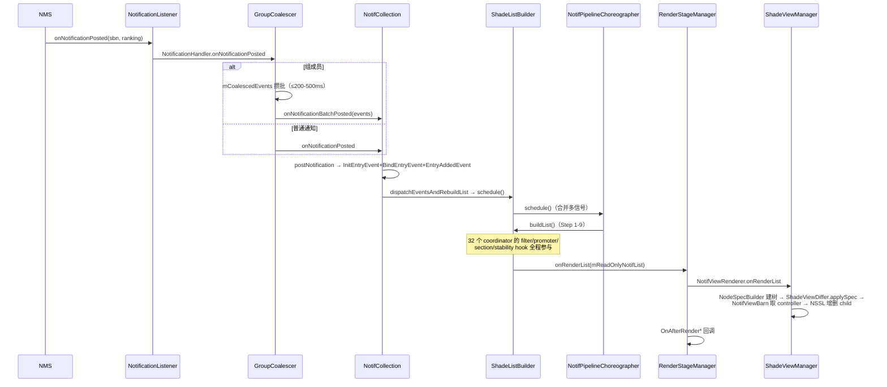

# 01 · 入口与管道（Ingress & Pipeline）

> 本篇讲通知**从 framework 事件到 shade 列表**的主管道（7 Stage 逐级展开）。卡片/横幅/交互分别在 [02](./02-card-and-inflate.md)/[03](./03-heads-up.md)/[06](./06-interaction.md) 篇。
> 基准：AOSP `android-17.0.0_r1`；引用格式 `路径` + `类#方法`，不标行号；凡源码摘录均已在本仓库验证。

## 1.0 全局装配：一次 initialize 挂起整条链

管道不是 Dagger 自动装配的，而是 `collection/init/NotifPipelineInitializer.java#initialize` **手工链式 attach** 出来的——理解这 7 行就理解了整条链的上下游：

```java
// NotifPipelineInitializer#initialize（核心装配段）
mNotifInflater.setRowBinder(rowBinder);              // inflate 闸门（02 篇）
mNotifPluggableCoordinators.attach(mPipelineWrapper); // STAGE 0：32 个 Coordinator 注册 hook
mShadeViewManager = mShadeViewManagerFactory.create(listContainer);
mShadeViewManager.attach(mRenderStageManager);        // STAGE 6 ← STAGE 5
mRenderStageManager.attach(mListBuilder);             // STAGE 5 ← STAGE 4
mListBuilder.attach(mNotifCollection);                // STAGE 4 ← STAGE 3
mNotifCollection.attach(mGroupCoalescer);             // STAGE 3 ← STAGE 2
mGroupCoalescer.attach(mNotificationService);         // STAGE 2 ← STAGE 1
```

dump 时同文件的 `dumpPipeline` 按 `STAGE 0: SETUP → STAGE 1: LISTEN → STAGE 2: BATCH EVENTS → STAGE 3: COLLECT → STAGE 4: BUILD LIST → STAGE 5: DISPATCH RENDER → STAGE 6: UPDATE SHADE` 逐级输出每级全部内部状态——**排查通知问题的第一命令**：

```bash
adb shell dumpsys activity service com.android.systemui/.SystemUIService NotifPipeline
```

## 1.1 STAGE 1 · NotificationListener：framework 入口契约

`statusbar/NotificationListener.java` 是 SystemUI 唯一的 `NotificationListenerService`（NLS）实现，继承 `NotificationListenerWithPlugins`（插件可拦截回调，见[插件化知识库](../2026-09-30-systemui-plugin-knowledge-base.md) §5.3）。

### 1.1.1 连接与初始快照（`onListenerConnected`）

```java
// NotificationListener#onListenerConnected（核心逻辑）
final StatusBarNotification[] notifications = getActiveNotifications();
final RankingMap currentRanking = getCurrentRanking();
mMainExecutor.execute(() -> {
    // b/146011844：getActiveNotifications 与 getCurrentRanking 之间有竞态，
    // ranking 可能缺 entry。对缺失项造 temporary stand-in Ranking 补全成完整 RankingMap。
    ...
    for (StatusBarNotification sbn : notifications) {
        for (NotificationHandler listener : mNotificationHandlers) {
            listener.onNotificationPosted(sbn, completeMap);
        }
    }
    for (NotificationHandler listener : mNotificationHandlers) {
        listener.onNotificationsInitialized();
    }
});
```

要点：
- **全量补发**：进程重启/服务重连时把现存通知当「新 post」逐条回放给 handler，最后统一 `onNotificationsInitialized`
- **ranking 竞态修复**：`getRankingOrTemporaryStandIn` 给缺 ranking 的通知造假条目，避免下游 NPE（b/146011844 的临时方案，TODO 长期修复）

### 1.1.2 Ranking 更新节流

```java
private static final long MAX_RANKING_DELAY_MILLIS = 500L;
private final Deque<RankingMap> mRankingMapQueue = new ConcurrentLinkedDeque<>();
```

`onNotificationRankingUpdate` 不立即下发，先进 `mRankingMapQueue` 攒批，500ms 内合并（防 ranking 风暴）；超时或事件触发时 `dispatchRankingUpdate` 一次性下发最新 map。

### 1.1.3 NotificationHandler 消费者

`addNotificationHandler(NotificationHandler)` 的全部调用方（源码 grep 实测）：

| 消费者 | 用途 |
|---|---|
| `GroupCoalescer`（`coalescer/GroupCoalescer.java:116`） | 管道正门（STAGE 2） |
| `PeopleSpaceWidgetManager`（`:781`） | People 微件旁路 |
| `DreamOverlayNotificationCountProvider`（`:84`） | AOD 通知计数旁路 |

## 1.2 STAGE 2 · GroupCoalescer：分组事件聚合

`coalescer/GroupCoalescer.java`——**问题**：group API 下组成员是一条条 post 的，「summary 先到 child 后到」会让列表先显示组再跳变。**方案**：组内事件攒成 batch 原子释放。

### 1.2.1 linger 常量（类内私有，非外部配置）

```java
private static final long MIN_GROUP_LINGER_DURATION = 200;
private static final long MAX_GROUP_LINGER_DURATION = 500;
```

批释放条件（`maybeEmitBatch`）：超过 linger 时长 / 组内任何一条被 update / 组内任何一条被 retract。**非组通知不经过 linger**（`handleNotificationPosted` 对 `!sbn.isGroup()` 直接透传返回 false）。

### 1.2.2 内部结构

- `mCoalescedEvents: Map<String, CoalescedEvent>`——key→延迟事件
- `mBatches: Map<String, EventBatch>`——groupKey→批次（含起始时间与释放 runnable）
- 全部 `@MainThread`；释放时走 `onNotificationBatchPosted(List<CoalescedEvent>)` 给 NotifCollection

## 1.3 STAGE 3 · NotifCollection：通知的家

`collection/NotifCollection.java`——以 `mNotificationSet: Map<String, NotificationEntry>` 为权威集合（`getAllNotifs()` = 「当前手机全部通知」，未排序未过滤未分组）。

### 1.3.1 入口一：`postNotification(sbn, ranking)`

```java
// NotifCollection#postNotification（两种分支）
NotificationEntry entry = mNotificationSet.get(sbn.getKey());
if (entry == null) {
    entry = new NotificationEntry(sbn, ranking, mClock.elapsedRealtime());
    mEventQueue.add(new InitEntryEvent(entry));
    mEventQueue.add(new BindEntryEvent(entry, sbn));
    mNotificationSet.put(sbn.getKey(), entry);
    mEventQueue.add(new EntryAddedEvent(entry));
} else {
    // 更新：postTime 相同→SystemServer 来源；不同→App 来源
    UpdateSource source = sbn.getPostTime() == lastUpdateTime
            ? UpdateSource.SystemServer : UpdateSource.App;
    cancelLocalDismissal(entry);   // 本地 dismiss 状态重置
    cancelLifetimeExtension(entry);
    cancelDismissInterception(entry);
    entry.mCancellationReason = REASON_NOT_CANCELED;
    entry.setSbn(sbn);
    mEventQueue.add(new EntryUpdatedEvent(entry, source));
}
```

注意事件经 `mEventQueue` 排队、`dispatchEventsAndRebuildList` 统一派发——**先攒事件后一次性重建列表**，避免同一批事件反复 buildList。

### 1.3.2 入口二：`onNotificationRemoved` → `tryRemoveNotification`

system server 撤回通知的路径只咨询 **`NotifLifetimeExtender`**：

```java
// NotifCollection#tryRemoveNotification（核心段）
if (cannotBeLifetimeExtended(entry)) {
    cancelLifetimeExtension(entry);
} else {
    updateLifetimeExtension(entry);   // 逐个 extender 询问「还要用吗」
}
if (!isLifetimeExtended(entry)) {
    mNotificationSet.remove(entry.getKey());
    mEventQueue.add(new EntryRemovedEvent(entry, entry.mCancellationReason));
    ...
} else {
    return false;   // 被 extend，暂不删；extender 之后调 endLifetimeExtension 才真删
}
```

典型 extender：`HeadsUpCoordinator`（横幅显示中）、`RemoteInputCoordinator`（回复发送中）。

### 1.3.3 入口三：`dismissNotifications`（用户主动 dismiss）

```java
// NotifCollection#dismissNotifications（核心段）
updateDismissInterceptors(storedEntry);   // 逐个 NotifDismissInterceptor 询问「要不要拦」
...
dispatchEventsAndRebuildList("dismissNotifications");
```

放行 → 向 NMS 发 cancel → NMS 回发 `onNotificationRemoved` → 走 §1.3.2 删除。当前镜像中唯一注册的 interceptor 是 `BubbleCoordinator`（bubble 通知的 dismiss 特殊处理）。

### 1.3.4 InternalNotifUpdater

`getInternalNotifUpdater(name)` 是管道**内部**修改通知的通道（如用户操作导致的本地状态变化回流 collection），更新事件带 `UpdateSource.SystemServer` 语义。

## 1.4 STAGE 4 · ShadeListBuilder：buildList 全走查

`ShadeListBuilder.java#buildList()` 是管道心脏。先看它的**状态机纪律**：`mPipelineState`（`STATE_BUILD_STARTED/RESETTING/PRE_GROUP_FILTERING/GROUPING/TRANSFORMING/GROUP_STABILIZING/SORTING/FINALIZE_FILTERING/FINALIZING/IDLE`）逐级推进；**一旦某级已过，再有 pluggable 想 invalidate 就直接抛异常**（重入保护）：

```java
// ShadeListBuilder#buildList（骨架，逐段展开见下）
mPipelineState.requireIsBefore(STATE_BUILD_STARTED);
if (!mNotifStabilityManager.isPipelineRunAllowed()) return;  // 视觉稳定期挂起
mPipelineState.setState(STATE_BUILD_STARTED);
// Step 1  RESETTING            resetNotifs() + onBeginRun()
// Step 2  PRE_GROUP_FILTERING  filterNotifs(mAllEntries, mNotifList, mNotifPreGroupFilters)
// Step 3  GROUPING             groupNotifs() + pruneIncompleteGroups()
// Step 3.5 bundling            bundleNotifs()（17 新：NmSummarization 束）
// Step 4  TRANSFORMING         dispatchOnBeforeTransformGroups → promoteNotifs()
// Step 4.5 GROUP_STABILIZING   stabilizeGroupingNotifs()
// Step 5  SORTING              assignSections() + notifySectionEntriesUpdated() + sortListAndGroups()
// Step 6  FINALIZE_FILTERING   dispatchOnBeforeFinalizeFilter → filterNotifs(…, mNotifFinalizeFilters)
// Step 7  FINALIZING           logChanges() + freeEmptyGroups() + cleanupPluggables()
// Step 8  dispatchOnBeforeRenderList → mOnRenderListListener.onRenderList(mReadOnlyNotifList)
// Step 9  logEndBuildList + STATE_IDLE
```

对应 `NotifPipeline.kt` 文档注释的 14 步 hook 顺序（对外承诺）：

| 步 | 动作 | 注册 API |
|---|---|---|
| 0 | collection listeners 触发 | `addCollectionListener` |
| 1 | pre-group filters（逐 entry，任一拒绝出局） | `addPreGroupFilter` |
| 2 | 初始分组（entry 挂 parent） | `groupNotifs` |
| 3 | OnBeforeTransformGroupsListeners | `addOnBeforeTransformGroupsListener` |
| 4 | NotifPromoters（child 提为顶层，如 HUN） | `addPromoter` |
| 5 | OnBeforeSortListeners | `addOnBeforeSortListener` |
| 6 | 分配 Section（首中即归段；section 必须连续，否则 `ShadeListBuilder#setSectioners` 抛 IllegalState） | `setSections` |
| 7 | 排序（comparator 链，全 0 回退 rank → `Notification.when`） | `setComparators` |
| 8 | OnBeforeFinalizeFilterListeners | `addOnBeforeFinalizeFilterListener` |
| 9 | finalize filters（如 PreparationCoordinator 的 inflate 闸门） | `addFinalizeFilter` |
| 10 | OnBeforeRenderListListeners | `addOnBeforeRenderListListener` |
| 11 | 移交视图层 | `RenderStageManager` |
| 12–13 | OnAfterRender List/Group/Entry（源码注释中 Group/Entry 同号 13） | `addOnAfterRender*Listener` |

### 1.4.1 三类可插拔在 buildList 中的位置

- **NotifFilter**（pre-group / finalize 两道）：`filterNotifs` 按注册顺序逐 entry 问，任一返回 true 即出局
- **NotifPromoter**：`promoteNotifs` 对每个有 parent 的 child 逐 promoter 问，任一返回 true 即提到顶层（[03 篇](./03-heads-up.md)的 HUN promoter 就在这一步工作）
- **NotifStabilityManager**（全局唯一，`setVisualStabilityManager` 重复设置抛异常）：

```java
// ShadeListBuilder#buildList 开头
if (!mNotifStabilityManager.isPipelineRunAllowed()) {
    mLogger.logPipelineRunSuppressed();
    return;   // 用户正注视列表时挂起重建
}
```

实现是 `VisualStabilityCoordinator.java`（Coordinator 兼 NotifStabilityManager）：`isEveryChangeAllowed()`/`isPipelineRunAllowed()` 依据「用户是否在注视/滚动」决定放行粒度。

### 1.4.2 分组与 Bundle

- `groupNotifs`：同 groupKey 的 entry 挂到 `GroupEntry`（summary=父）；`pruneIncompleteGroups` 清理只剩 summary 或只剩 child 的残组
- `bundleNotifs`（Step 3.5，17 新）：`NotifBundler` 按分类把多条通知合成 `BundleEntry`（AI 摘要束，`NmSummarizationAllFlag` 门控，见 [07 篇](./07-project-landing.md) flags 表）

## 1.5 STAGE 0 · NotifCoordinators：32 个子系统装配器

`coordinator/NotifCoordinators.kt`（`@CoordinatorScope`）。attach 顺序 = init 块 `mCoordinators.add(...)` 顺序（29 个常驻 + 3 个 flag 门控）：

```kotlin
// NotifCoordinatorsImpl init（节选，全 32 个）
mCoordinators.add(hideLocallyDismissedNotifsCoordinator)   // 本地已 dismiss 隐藏
mCoordinators.add(hideNotifsForOtherUsersCoordinator)      // 锁屏隐藏其他用户
mCoordinators.add(keyguardCoordinator)                     // 锁屏可见性
if (NotificationMinimalism.isEnabled) mCoordinators.add(lockScreenMinimalismCoordinator) // flag 门控
mCoordinators.add(unseenKeyguardCoordinator)               // 未读点
mCoordinators.add(rankingCoordinator)                      // ranking 入管道
...
mCoordinators.add(preparationCoordinator)                  // inflate 闸门（→ 02 篇）
mCoordinators.add(headsUpCoordinator)                      // HUN（→ 03 篇）
mCoordinators.add(visualStabilityCoordinator)              // NotifStabilityManager 实现
mCoordinators.add(remoteInputCoordinator)                   // inline 回复（→ 06 篇）
mCoordinators.add(summarizationCoordinator)                 // 17：AI 摘要
mCoordinators.add(bundleCoordinator)                       // 17：BundleEntry
if (...) mCoordinators.add(highlightsCoordinator)           // flag 门控
if (...) mCoordinators.add(hsuCoordinator)                  // flag 门控
```

模式统一：`attach(pipeline)` 时注册本子系统的 filter/promoter/section/listener，之后靠 invalidation 驱动重建。深读三个代表：

### 1.5.1 PreparationCoordinator（inflate 闸门，02 篇的门）

`coordinator/PreparationCoordinator.java`——核心状态：

```java
private final ArrayMap<NotificationEntry, Integer> mInflationStates;        // UNINFLATED/INFLATING/INFLATED
private final ArrayMap<NotificationEntry, NotifUiAdjustment> mInflationAdjustments;
private final ArraySet<NotificationEntry> mInflatingNotifs;
private final int mChildBindCutoff;          // 组内 child 只保留前 N 个 inflate
private final long mMaxGroupInflationDelay;  // 组等待全部 child 的最长时限
```

机制：`addOnBeforeFinalizeFilterListener(this::inflateAllRequiredViews)` 在 Step 8 触发 inflate；`mNotifInflatingFilter`（+ `mNotifInflationErrorFilter`）作为 finalize filter 把「还没 inflate 完 / inflate 失败」的 entry 挡在最终列表外。`NotifUiAdjustment` 变化（如锁屏红action 切换）→ abort 并重启 inflate。

### 1.5.2 RankingCoordinator

ranking 更新经它进入管道（`addCollectionListener` + ranking map 维护）；同时管理 group linger 相关排序语义（`RankingComparator`）。

### 1.5.3 VisualStabilityCoordinator

实现 `NotifStabilityManager` 的三个判定（`VisualStabilityCoordinator.java`）：

```java
public boolean isPipelineRunAllowed() { ... }       // 是否允许本轮 buildList
public boolean isEveryChangeAllowed() { ... }       // 分组/排序/段变更是否允许
boolean isGroupPruneAllowedForEntry(...) { ... }    // 残组清理是否允许
```

用户正滚动/注视列表时收敛变更粒度，防止条目乱跳。

## 1.6 STAGE 5/6 · 渲染分发与视图 diff

### 1.6.1 RenderStageManager

`render/RenderStageManager.kt`——接 `ShadeListBuilder` 的 `onRenderList`：

```kotlin
// RenderStageManager#onRenderList
viewRenderer.onRenderList(notifList)      // 交给视图渲染器
dispatchOnAfterRenderList(notifList)      // 渲染后修补回调（coordinator 可做收尾）
dispatchOnAfterBundleRenderEntries(...)
dispatchOnAfterRenderGroups(...)
dispatchOnAfterRenderEntries(...)
viewRenderer.onDispatchComplete()
```

`NotifViewRenderer` 是接口，实现在 shade 侧。

### 1.6.2 ShadeViewManager / NodeSpecBuilder / ShadeViewDiffer

视图 diff 的三段式（`render/ShadeViewManager.kt:92-96`）：

1. **NodeSpecBuilder#buildNodeSpec**：把 `List<PipelineEntry>` 建成节点树（`NodeSpec`，每个节点一个 `NodeController`，如 `RootNodeController`/group 节点/entry 节点）
2. **ShadeViewDiffer#applySpec**：把目标结构与当前结构 diff——「加哪些 row / 移哪些 row / 顺序怎么变」：

```kotlin
// ShadeViewDiffer（核心语义）
class ShadeViewDiffer(rootController: NodeController, ...) {
    private val rootNode = ShadeNode(rootController)
    private val nodes = mutableMapOf(rootController to rootNode)
    /** Adds and removes views from the root (and its children) until their structure matches the provided spec. */
    fun applySpec(spec: NodeSpec) = traceSection("ShadeViewDiffer.applySpec") { ... }
}
```

3. **NotifViewBarn**：entry.key→`NotifViewController` 映射缓存：

```kotlin
// NotifViewBarn.kt
fun requireRowController(entry: NotificationEntry): NotifRowController   // 未命中直接 error("No view has been registered...")
fun registerViewForEntry(entry: PipelineEntry, controller: NotifViewController)
```

未命中即报错的语义：说明 PreparationCoordinator 闸门未放行（row 还没 inflate）——渲染层永远只拿到已就绪的视图。

## 1.7 调度器：NotifPipelineChoreographer

`NotifPipelineChoreographer.kt`——所有「我变了需要重建列表」的信号（filter invalidated、entry 增删改、ranking 更新）最终汇到 `schedule()`：

```kotlin
// NotifPipelineChoreographerImpl
override fun schedule() {
    if (isScheduled) return
    isScheduled = true
    viewChoreographer.postFrameCallback(frameCallback)   // 下一帧合并执行
    ...
    timeoutSubscription = executor.executeDelayed(::onTimeout, TIMEOUT_MS)  // 100ms 兜底
}
```

保证：一帧内 N 个变化只触发一次 `buildList`；帧回调被同步执行等异常路径由 100ms `TIMEOUT_MS` 超时强制执行。

## 1.8 时序：post 一条普通通知（端到端）



## 1.9 本篇小结（本项目落点）

- 全部 `:SystemUI-core`：`statusbar/NotificationListener.java` + `statusbar/notification/collection/**`。
- 17 新 flag 分叉多：`NmSummarizationAllFlag`（bundle）、`NotificationMinimalism`（锁屏极简 coordinator）——读代码先查 flag。
- **dump 是排查第一步**：`dumpsys … SystemUIService NotifPipeline` 按 STAGE 0–6 打印全部内部状态（每个 coordinator 的私有字段都在 STAGE 0 段）。
- `PreparationCoordinator`（inflate 闸门）是通往 [02 · 通知卡片与 inflate](./02-card-and-inflate.md) 的门；`HeadsUpCoordinator` 是 [03 · 横幅](./03-heads-up.md) 的门。
