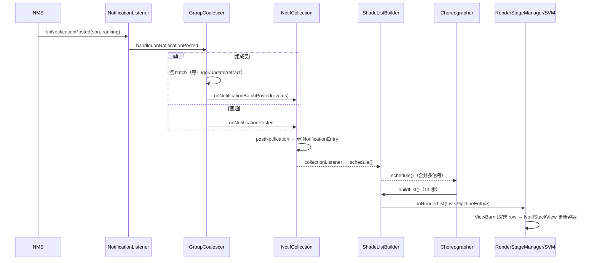

# 01 · 入口与管道（Ingress & Pipeline）

> 本篇讲通知**从 framework 到 shade 列表**的主管道。卡片/横幅/交互分别在 02/03/06 篇。

## 1.1 framework 入口契约

`SystemUI-core/src/com/android/systemui/statusbar/NotificationListener.java` 是 SystemUI 唯一的 NLS（NotificationListenerService）实现，继承 `NotificationListenerWithPlugins`（插件可拦截通知回调，见插件化知识库 §5.3）。关键行为：

- **`onListenerConnected`**：拉 `getActiveNotifications()` 全量快照 + `getCurrentRanking()`；**有已知竞态**（ranking 可能缺 entry，b/146011844），对缺失项造 temporary stand-in Ranking 补全成完整 `RankingMap` 后再分发；主线程上向所有 `NotificationHandler` 补发 `onNotificationPosted` + `onNotificationsInitialized`。
- **Ranking 更新节流过 500ms**（`MAX_RANKING_DELAY_MILLIS`）：`mRankingMapQueue` 攒批，超时或事件触发时 `dispatchRankingUpdate`。
- `NotificationHandler` 是内部分发接口；当前消费者是 GroupCoalescer（管道）+ `PeopleSpaceWidgetManager`（People 微件）/ `DreamOverlayNotificationCountProvider`（AOD 通知计数）等旁路。

## 1.2 STAGE 2 · GroupCoalescer：分组事件聚合

问题来源：group API 下一个组的成员是一条条 post 的，「summary 先到 child 后到」会让列表先显示组再跳变。**Coalescer 把组内延迟事件攒成 batch，满足任一条件即原子释放**：

- 超过 linger 时长（`MIN/MAX_GROUP_LINGER_DURATION`，为 GroupCoalescer 内部常量 200ms/500ms，非外部配置）
- 组内任何一条被 update / retract

实现：`mCoalescedEvents`（key→CoalescedEvent）+ `mBatches`（groupKey→EventBatch），全部 `@MainThread`。释放时走 `onNotificationBatchPosted(List<CoalescedEvent>)` → NotifCollection。**非组通知不经过 linger，直接透传**。

## 1.3 STAGE 3 · NotifCollection：通知的家

`statusbar/notification/collection/NotifCollection.java`：以 `key → NotificationEntry` 为权威集合（`getAllNotifs()` 即「当前手机上的全部通知」，未排序未过滤未分组）。三个入口动作（主线程）：

- `postNotification`：新建 `NotificationEntry`（通知 `NotifCollectionListener.onEntryAdded`）
- `updateNotification`：更新 entry 的 sbn/ranking（`onEntryUpdated`）
- `onNotificationRemoved`（system server retract）：只问 **`NotifLifetimeExtender`**——system server 已撤回但 UI 还需要显示时延期移除，记录到 `entry.mLifetimeExtenders`；extender 之后调 `endLifetimeExtension` 才真正删
- `dismissNotifications`（用户点 dismiss）：先问 **`NotifDismissInterceptor`**（如敏感内容未解锁），拦下则不向 system server 发取消

`InternalNotifUpdater`（`getInternalNotifUpdater(name)`）是管道**内部**修改通知的通道（用户操作导致的本地状态变化回流 collection）。

## 1.4 STAGE 4 · ShadeListBuilder：14 步构建列表

`ShadeListBuilder.java#buildList()` 是管道心脏。`NotifPipeline.kt` 文档注释给出精确顺序（各 hook 由 Coordinator 注册）：

| 步 | 动作 |
|---|---|
| 0 | 触发 collection listeners |
| 1 | **pre-group filters**（按注册顺序逐 entry，任一拒绝即出局） |
| 2 | 初始分组（entry 挂 parent） |
| 3 | OnBeforeTransformGroupsListeners |
| 4 | **NotifPromoters**（child 可提升为顶层，如 HUN 把 child 提上来） |
| 5 | OnBeforeSortListeners |
| 6 | **分配 Section**（sectioner 按序首中即归其段；section 必须连续，否则 IllegalState） |
| 7 | **排序**（comparator 链，全 0 回退 rank → `Notification.when`） |
| 8 | OnBeforeFinalizeFilterListeners |
| 9 | **finalize filters**（渲染前最后一道过滤；典型是 PreparationCoordinator 的 `mNotifInflatingFilter`——row 还没 inflate 完的不给渲染，另有 `mNotifInflationErrorFilter` 滤掉膨胀失败的，本篇与 02 篇的接缝） |
| 10 | OnBeforeRenderListListeners |
| 11 | 移交给视图层 |
| 12–13 | OnAfterRender List/Group/Entry（经 RenderStageManager；源码注释中 Group/Entry 同号为 13） |

**NotifStabilityManager**（视觉稳定性，`setVisualStabilityManager` 只能设一次）：`buildList()` 开头先问 `isPipelineRunAllowed()`；不允许时挂起，直到列表不再被用户注视才放跑（防用户正看着列表时条目乱跳）。

## 1.5 STAGE 0 · NotifCoordinators：32 个子系统装配器

`collection/coordinator/NotifCoordinators.kt`（`@CoordinatorScope`）。attach 序节选重点：

| Coordinator | 干什么 |
|---|---|
| `HideLocallyDismissedNotifsCoordinator` | 本地已 dismiss 的隐藏 |
| `HideNotifsForOtherUsersCoordinator` | 锁屏隐藏其他用户通知 |
| `KeyguardCoordinator` / `OriginalUnseenKeyguardCoordinator` / `LockScreenMinimalismCoordinator` | 锁屏三件套（minimalism 为 flag 门控新形态） |
| `RankingCoordinator` | ranking 更新入管道 + group linger 配置 |
| `PreparationCoordinator` | **inflate 闸门**：通知先 inflate 完才过 finalize filter（→ 02 篇） |
| `HeadsUpCoordinator` | HUN 与列表互转（→ 03 篇主体） |
| `ConversationCoordinator` | 对话（People）通知优先级/section |
| `MediaCoordinator` | 媒体通知 special handling |
| `VisualStabilityCoordinator` | 实现 NotifStabilityManager |
| `RemoteInputCoordinator` | inline 回复生命周期（→ 06 篇） |
| `SummarizationCoordinator` / `BundleCoordinator` | **17 新增**：`NmSummarizationAllFlag` 门控的 AI 摘要 + BundleEntry 束 |
| `SensitiveContentCoordinator` / `DismissibilityCoordinator` / `HighlightsCoordinator` / `HsuCoordinator`… | 敏感内容、可清除性、高亮等 |

模式统一：`attach(pipeline)` 时注册本子系统的 filter/promoter/section/listener，之后靠 invalidation 驱动重建。

## 1.6 STAGE 5/6 · 渲染分发与视图层

- `RenderStageManager`（`collection/render/RenderStageManager.kt`）：接 `ShadeListBuilder` 最终 `List<PipelineEntry>` → 调 `NotifViewRenderer.onRenderList` → 派发 OnAfterRender* 回调（coordinator 可做渲染后修补）。
- `ShadeViewManager`（`render/ShadeViewManager.kt`）：`NotifViewRenderer` 实现装配点，持有 `NotifViewBarn`（entry.key→`NotifViewController` 缓存），经 `ShadeViewDiffer` + `NodeController`（如 `RootNodeController`）操作注入的 `NotificationListContainer` 增删 child；高度/动画参数计算在 NSSL 侧（→ 04 篇）。

## 1.7 调度器：NotifPipelineChoreographer

所有「我变了需要重建列表」的信号（filter invalidated、entry 增删改、ranking 更新）最终汇到 `NotifPipelineChoreographer.schedule()`：**Choreographer 下一帧合并执行** buildList；帧回调同步执行等异常路径由 100ms `TIMEOUT_MS` 超时兜底强制执行。保证一帧内 N 个变化只重建一次列表。

## 1.8 时序：post 一条普通通知

## 1.9 本篇小结（本项目落点）

- 全部在 `:SystemUI-core`：`statusbar/NotificationListener.java` + `statusbar/notification/collection/**`。
- 17 新 flag 分叉多：`NmSummarizationAllFlag`、`NotificationMinimalism` 等——读代码先查 flag（与前两篇知识库同一纪律）。
- **现场 dump（排查第一步）**：`adb shell dumpsys activity service com.android.systemui/.SystemUIService NotifPipeline`——打印 STAGE 0–6 每级完整内部状态（`NotifPipelineInitializer#dumpPipeline`）。
- `PreparationCoordinator`（inflate 闸门）是通往 [02 · 通知卡片与 inflate](./02-card-and-inflate.md) 的门。
