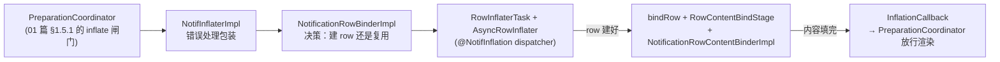

# 02 · 通知卡片与 inflate（Card & Inflate）

> 本篇讲通知从 `NotificationEntry` 到可显示卡片的视图化过程。管道见 [01](./01-ingress-pipeline.md)，横幅态切换见 [03](./03-heads-up.md)。
> 基准：AOSP `android-17.0.0_r1`；引用格式 `路径` + `类#方法`；源码摘录均已验证。

## 2.1 三层对象模型：Entry → Row → ContentView

```
NotificationEntry（数据，管道内流转）
  └─ row: ExpandableNotificationRow（卡片壳，一个 entry 最多一个）
       ├─ privateLayout: NotificationContentView（私有内容槽，多个 child 互斥显示）
       │    ├─ mContractedChild   折叠态（列表默认）
       │    ├─ mExpandedChild     展开态（双指展开/大视图）
       │    ├─ mHeadsUpChild      横幅态（HUN 时切到它）
       │    └─ mSingleLineView    组内 child 的单行精简态（HybridNotificationView）
       ├─ publicLayout: NotificationContentView（锁屏隐藏敏感内容时的「公开版」）
       └─ guts / menuRow / dismiss button…（SystemUI 自己加的附属层）
```

### 2.1.1 NotificationEntry 与 PipelineEntry

- `collection/NotificationEntry.java`：SystemUI 侧权威数据模型——sbn、ranking、channel、row 引用、`mLifetimeExtenders`、`mDismissInterceptors`、`mCancellationReason`。日志键在 row 侧（`ExpandableNotificationRow.mLoggingKey`）
- 继承 `ListEntry.kt` → `PipelineEntry.kt`：管道统一遍历的抽象（`getChildCount`/`getParent`/`getSection` 等），`GroupEntry`/`BundleEntry` 是兄弟类
- entry 与 row 的绑定：`entry.setRow(row)` / `entry.setRowController(controller)`（`NotificationRowBinderImpl#bindRow` 调用）

### 2.1.2 ExpandableNotificationRow 继承链

`row/ExpandableNotificationRow.java:164`：

```java
public class ExpandableNotificationRow extends ActivatableNotificationView
        implements PluginListener<NotificationMenuRowPlugin>, SwipeableView,
        NotificationFadeAware.FadeOptimizedNotification {
```

| 层 | 职责 |
|---|---|
| `ExpandableView` | 基础视图状态（可见性/高度/裁剪钩子） |
| `ExpandableOutlineView` | 圆角 outline 裁剪 |
| `ActivatableNotificationView` | 按压/激活背景、触摸处理（`TouchHandler`，见 [06 篇](./06-interaction.md)） |
| `ExpandableNotificationRow` | 卡片本体：内容槽切换、展开/收起状态、guts/menu 宿主 |

**Row 自己不承载 RemoteViews**——只是容器 + 状态机。膨胀分**两次异步**：先建 row 壳（`RowInflaterTask`），再填内容（`NotificationRowContentBinderImpl`）。

### 2.1.3 NotificationContentView 槽位机制

`row/NotificationContentView.java`：

```java
public static final int VISIBLE_TYPE_CONTRACTED = 0;
public static final int VISIBLE_TYPE_EXPANDED   = 1;
public static final int VISIBLE_TYPE_HEADSUP    = 2;
public static final int VISIBLE_TYPE_SINGLELINE = 3;
private static final int VISIBLE_TYPE_NONE = -1;

private View mContractedChild;
private View mExpandedChild;
private View mHeadsUpChild;
protected HybridNotificationView mSingleLineView;
```

`mVisibleType` 决定显示哪个 child；测量时 `measureChildWithMargins` 对各 child 取 `maxChildHeight` 决定容器高度。

## 2.2 膨胀总管线：五角色两段异步



### 2.2.1 PreparationCoordinator 的闸门

`coordinator/PreparationCoordinator.java`（01 篇 §1.5.1 详列字段）：`addOnBeforeFinalizeFilterListener(this::inflateAllRequiredViews)` 在 buildList Step 8 触发 inflate；finalize filter `mNotifInflatingFilter`（+ `mNotifInflationErrorFilter`）把「还没 inflate 完 / inflate 失败」的 entry 挡在最终列表外——**「通知 posted 了但列表里慢半拍」的机制性原因**（正常非 bug）。`NotifUiAdjustment`（红action/最小化等参数快照）变化时 abort 并重启 inflate。

### 2.2.2 NotifInflaterImpl：错误处理包装

`collection/NotifInflaterImpl.java`——薄包装，把 `InflationException` 转给 `NotifInflationErrorManager`（UI 显示「此通知无法显示」故障卡），成功回调 `clearInflationError`：

```java
// NotifInflaterImpl#wrapInflationCallback（核心）
public void handleInflationException(Exception e) {
    mNotifErrorManager.setInflationError(entry, e);
}
public void onAsyncInflationFinished() {
    mNotifErrorManager.clearInflationError(entry);
    callback.onInflationFinished(entry, entry.getRowController());
}
```

### 2.2.3 NotificationRowBinderImpl：决策点

`collection/inflation/NotificationRowBinderImpl.java#inflateViews`：

- `entry.rowExists()` → **复用**：`mIconManager.updateIcons` + `row.reset()` + `updateRow(entry, row)`（设 legacy 标记 + `NotificationClicker.register`）+ `inflateContentViews`
- 否则 → **新建**：`mIconManager.createIcons` + `RowInflaterTask.inflate` 异步建 row；回调里：
  1. `mExpandableNotificationRowComponentBuilder…build()` 建 **Dagger 子组件** `ExpandableNotificationRowComponent`（`row/dagger/`，`@Subcomponent.Builder`），取得 `ExpandableNotificationRowController` 与 `BigPictureIconManager`
  2. `bindRow` 五连：`mListContainer.bindRow(row)` / `mNotificationRemoteInputManager.bindRow(row)` / `entry.setRow(row)` / `mNotifBindPipeline.manageRow(entry, row)` / `mPresenter.onBindRow(row)`
  3. `inflateContentViews`

### 2.2.4 RowInflaterTask + AsyncRowInflater：段一（建壳）

`row/RowInflaterTask.java#inflate` → `row/AsyncRowInflater.kt#inflate`：

```kotlin
// AsyncRowInflater#inflate（线程模型核心）
val inflater = BasicRowInflater(context).apply { factory2 = layoutFactory }
return applicationScope.launchTraced("AsyncRowInflater-bg", inflationCoroutineDispatcher) {
    val view = try {
        inflater.inflate(R.layout.status_bar_notification_row, parent, false)
    } catch (ex: RuntimeException) {
        // Probably a Looper failure, retry on the UI thread
        null
    }
    withContextTraced("AsyncRowInflater-ui", mainCoroutineDispatcher) {
        val finalView = view ?: inflater.inflate(resId, parent, false)  // 主线程重试一次
        listener.onInflateFinished(finalView, resId, parent)
    }
}
```

- `BasicRowInflater`：装了 `Factory2` 的 LayoutInflater 封装（`NotifLayoutInflaterFactory` 统计布局）
- 后台 inflate 失败 → 主线程自动重试一次
- `RowInflaterTask` 实现 `InflationTask`，支持 `abortTask()`（entry 被移除时中止）

## 2.3 内容绑定的 flag 体系

`row/NotificationRowContentBinder.java` 的 `@InflationFlag`（8 个位标志）：

```java
int FLAG_CONTENT_VIEW_CONTRACTED        = 1;        // 折叠态，永远需要
int FLAG_CONTENT_VIEW_EXPANDED          = 1 << 1;   // 展开态，永远需要
int FLAG_CONTENT_VIEW_HEADS_UP          = 1 << 2;   // HUN 态（→ 03 篇）
int FLAG_CONTENT_VIEW_PUBLIC            = 1 << 3;   // 锁屏公开版（redactionType != NONE）
int FLAG_CONTENT_VIEW_SINGLE_LINE       = 1 << 4;   // 组内 child 单行
int FLAG_GROUP_SUMMARY_HEADER           = 1 << 5;   // 组 summary 头
int FLAG_LOW_PRIORITY_GROUP_SUMMARY_HEADER = 1 << 6;// 低优先级组头（minimized）
int FLAG_CONTENT_VIEW_PUBLIC_SINGLE_LINE   = 1 << 7;// 组内 child + 锁屏
int FLAG_CONTENT_VIEW_ALL = (1 << 8) - 1;
```

`RowContentBindParams`（`requireContentViews` / `markContentViewsFreeable` / `markDirty`）维护每个 entry 的「需要哪些槽」；`RowContentBindStage#executeStage` 计算差量：

```java
// RowContentBindStage#executeStage（核心）
@InflationFlag int contentToBind = invalidatedFlags & inflationFlags;   // 要绑 = dirty ∩ required
@InflationFlag int contentToUnbind = inflationFlags ^ FLAG_CONTENT_VIEW_ALL; // 要解 = 不在 required
mBinder.unbindContent(entry, row, contentToUnbind);
mBinder.cancelBind(entry, row);
mBinder.bindContent(entry, row, contentToBind, bindParams, forceInflate, inflationCallback);
```

`NotificationRowBinderImpl#inflateContentViews` 把 `NotifInflater.Params`（isMinimized/redactionType/showSnooze/是否组 summary）翻译成 flag 集（如 `isChildInGroup` 加 `SINGLE_LINE`，组 summary 加 `GROUP_SUMMARY_HEADER`），然后 `RowContentBindStage.requestRebind` 执行。

## 2.4 段二：NotificationRowContentBinderImpl 全走查

`row/NotificationRowContentBinderImpl.kt`——真正创建/应用 RemoteViews 的地方。`bindContent` 入口：

```kotlin
// NotificationRowContentBinderImpl#bindContent（核心）
if (row.isRemoved) return                      // 已移除的不 reinflate，防 view 泄漏
row.imageResolver.preloadImages(sbn.notification)  // 内联图预载
if (forceInflate) remoteViewCache.clearCache(entry)
cancelContentViewFrees(row, contentToBind)     // 撤销待释放的槽
val task = AsyncInflationTask(inflationExecutor, inflateSynchronously, ...)
if (inflateSynchronously) task.onPostExecute(task.doInBackground())
else task.executeOnExecutor(inflationExecutor)
```

### 2.4.1 AsyncInflationTask 后台阶段（`doInBackgroundInternal`）

```kotlin
// 1. 重建 Builder（原始 Notification → Notification.Builder）
val recoveredBuilder = Notification.Builder.recoverBuilder(context, sbn.notification)
// 模板通知套 RtlEnabledContext（RTL 支持）
// 2. beginInflationAsync → createRemoteViews（每个 flag 一个 RemoteViews）
// 3. inflateSmartReplyViews（智能回复视图附加）
// 4. SingleLineViewInflater.inflatePrivateSingleLineView（组内单行）
```

### 2.4.2 createRemoteViews：每个 flag 的构建分支

```kotlin
// NotificationRowContentBinderImpl#createRemoteViews（分支全表）
contracted = createContentView(builder, bindParams.isMinimized)
expanded   = createExpandedView(builder, bindParams.isMinimized)
headsUp    = if (isHeadsUpCompact) builder.createCompactHeadsUpContentView()
             else builder.createHeadsUpContentView()          // deprecated 分支
public     = if (bindParams.redactionType == REDACTION_TYPE_OTP)
                 createSensitiveContentMessageNotification(...).createContentView()
             // 原通知是 MessagingStyle 时重建 MessagingStyle，否则仅替换 contentText
             else builder.makePublicContentView(bindParams.isMinimized)
normalGroupHeader   = builder.makeNotificationGroupHeader()
minimizedGroupHeader = builder.makeLowPriorityContentView(true)
```

compact/传统横幅样式选择在 `HeadsUpStyleProvider.shouldApplyCompactStyle(displayId)`（display 维度）。产出 `NewRemoteViews`（contracted/headsUp/expanded/public/两个组头）再 `withLayoutInflaterFactory` 递归装 `NotifLayoutInflaterFactory`（布局优化统计）与 big-picture lazy loading 钩子（`Flags.BIGPICTURE_NOTIFICATION_LAZY_LOADING` 门控，经 `NotifRemoteViewsFactoryContainer` 注入）。

### 2.4.3 apply：reapply vs 全量 inflate

`apply` 对每个 flag 逐槽处理：

```kotlin
// apply 的判定逻辑（每槽重复）
val isNewView = !canReapplyRemoteView(
    newView = result.remoteViews.contracted,
    oldView = remoteViewCache.getCachedView(entry, FLAG_CONTENT_VIEW_CONTRACTED),
)
// canReapplyRemoteView：package 与 layoutId 一致且旧视图无 FLAG_REAPPLY_DISALLOWED
//   → reapply（RemoteViews 增量应用，便宜）
//   → 否则全量 inflate（贵）
applyRemoteView(inflationExecutor, inflateSynchronously, ..., parentLayout = privateLayout,
    existingView = privateLayout.contractedChild, ...)
```

- 缓存：`NotifRemoteViewCacheImpl`（`NotifRemoteViewCache`）按 entry+flag 记旧 RemoteViews
- `InflationTaskTracker`（`runningInflations`）跟踪全部槽的应用进度，**全部完成**才 `onAsyncInflationFinished` → stage callback → PreparationCoordinator 放行
- 槽归属：contracted/expanded/headsUp/singleLine → `privateLayout`（`NotificationContentView`）；public → `publicLayout`；组头 → children container

## 2.5 错误处理与「故障卡」

| 环节 | 处理 |
|---|---|
| `InflationException`（同步抛出） | `NotifInflaterImpl#inflateViewsImpl` catch → `NotifInflationErrorManager#setInflationError` |
| 异步任务异常 | `AsyncInflationTask#handleError` → 同上 |
| 成功 | `clearInflationError` |
| UI 表现 | 该 entry 显示错误占位卡（`mNotifInflationErrorFilter` 同时把它挡出列表） |

排查：`dumpsys … NotifPipeline` 看 PreparationCoordinator 段（`mInflationStates`/`mInflatingNotifs`）；logcat tag `NotificationRowBinder` / `NotifBindPipeline`。

## 2.6 NotifBindPipeline 与 BindStage 抽象

`row/NotifBindPipeline.java`（类注释即设计文档）——「把通知从数据形态转换成正确且最新的视图」的编排器：

- 维护 `mBindEntries: Map<NotificationEntry, BindEntry>`，响应显式 bind 请求（add/update、设备设置变化、内存优化释放）
- 当前只挂一个 stage（`RowContentBindStage`）；注释明确「将来应把 row inflation 也拆成 stage」
- `BindStage<Params>`（`row/BindStage.java`）：`getStageParams(entry)`（每个 entry 一份 `RowContentBindParams`）+ `executeStage/abortStage` 模板方法；`BindRequester.requestRebind` 触发执行

## 2.7 周边视图速览（卡片家族）

| 组件 | 作用 |
|---|---|
| `row/wrapper/`（`NotificationViewWrapper` 等） | 按 inflated view 结构生成包装器，提供标准测量/展开高度计算（不同 RemoteViews 结构自适应） |
| `HybridNotificationView` / `HybridGroupManager` | 锁屏/紧凑场景组内 child 的单行混合视图（icon+单行文本） |
| `NotificationGuts` / `NotificationGutsManager` | 长按出的通道/静音/设置面板（→ [06 篇](./06-interaction.md)） |
| `NotifRemoteViewsFactory` + `NotifLayoutInflaterFactory` | RemoteViews inflate 工厂层（布局优化 flag 门控） |
| `BigPictureIconManager` | 大图懒加载（`Flags.BIGPICTURE_NOTIFICATION_LAZY_LOADING`） |
| `SingleLineViewInflater.kt` | 组内单行视图构建（contentModel.singleLineViewModel） |

## 2.8 本篇小结（本项目 Gradle 落点）

- 全部 `:SystemUI-core`：`collection/NotifInflaterImpl.java`、`collection/inflation/`（9 文件）、`row/`（~95 顶层文件，含子目录 ~160；本篇覆盖 ~15 个核心）。
- `@NotifInflation` 由 dagger 并发模块提供（`SysUIConcurrencyModule` 提供 `@NotifInflation` Looper/Executor，`util/kotlin/SysUICoroutinesModule` 再包装为 CoroutineDispatcher；row inflate 与 content inflate 共用后台线程纪律）。
- 相关 flag：`BIGPICTURE_NOTIFICATION_LAZY_LOADING`、compact HUN style（`HeadsUpStyleProvider`，display 维度）、布局优化系列——改卡片 UI 前先查开关状态。
- 与 [03 · 横幅](./03-heads-up.md) 的接缝：`FLAG_CONTENT_VIEW_HEADS_UP` 与 `HeadsUpCoordinator`。
