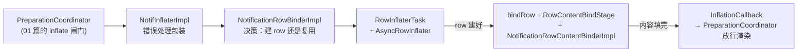

# 02 · 通知卡片与 inflate（Card & Inflate）

> 本篇讲通知从 `NotificationEntry` 到可显示卡片的视图化过程。管道见 [01](./01-ingress-pipeline.md)，横幅态切换见 [03](./03-heads-up.md)。

## 2.1 三层对象模型：Entry → Row → ContentView

```
NotificationEntry（数据，管道内流转）
  └─ row: ExpandableNotificationRow（卡片壳，一个 entry 最多一个）
       ├─ privateLayout: NotificationContentView（私有内容槽，多个 child 互斥显示）
       │    ├─ contractedChild   折叠态（列表默认）
       │    ├─ expandedChild     展开态（双指展开/大视图）
       │    ├─ headsUpChild      横幅态（HUN 时切到它）
       │    └─ singleLineView    组内 child 的单行精简态（HybridNotificationView）
       ├─ publicLayout: NotificationContentView（锁屏隐藏敏感内容时的「公开版」）
       └─ guts / menuRow / dismiss button…（SystemUI 自己加的附属层）
```

- `NotificationEntry`（`statusbar/notification/collection/NotificationEntry.java`）：SystemUI 侧权威数据模型——sbn、ranking、channel、row 引用、lifetime extenders、dismiss interceptors、日志键。**主线程对象**。
- `ExpandableNotificationRow`（`row/ExpandableNotificationRow.java`）：继承链 `ExpandableView → ExpandableOutlineView → ActivatableNotificationView → ExpandableNotificationRow`。它自己**不承载 RemoteViews**，只是容器 + 展开/收起状态机 + 圆角/裁剪/滑动菜单宿主。膨胀分**两次**：先建 row 壳（异步），再填内容（RemoteViews，也异步）。

## 2.2 膨胀总管线：五角色两段异步



1. **PreparationCoordinator**（01 篇 §1.5）收到新/更新 entry → 调 `NotifInflater.inflateViews`；**inflate 完成前该 entry 被 mInflationFilter 挡在 finalize filter 外**——「通知 posted 了但列表里慢半拍」的机制性原因（正常，非 bug）。
2. **NotifInflaterImpl**（`collection/NotifInflaterImpl.java`）：薄包装——异常转给 `NotifInflationErrorManager`（UI 显示「此通知无法显示」故障卡），成功回调清错。真正实现在 `NotificationRowBinderImpl`。
3. **NotificationRowBinderImpl**（`collection/inflation/NotificationRowBinderImpl.java`）——决策点：
   - `entry.rowExists()` → 复用：`row.reset()` + 更新图标 + `inflateContentViews`
   - 否则 → `mIconManager.createIcons` + `RowInflaterTask` 异步建 row；回调里建 `ExpandableNotificationRowComponent`（Dagger 子组件，挂 Controller/BigPictureIconManager）→ `bindRow`（`NotificationListContainer.bindRow`、`NotificationRemoteInputManager.bindRow`、`entry.setRow`、`NotifBindPipeline.manageRow`、`NotificationPresenter.onBindRow`）→ `inflateContentViews`
4. **RowInflaterTask + AsyncRowInflater**（`row/RowInflaterTask.java`、`row/AsyncRowInflater.kt`）：在 `@NotifInflation` dispatcher 上 inflate `R.layout.status_bar_notification_row`；**后台失败自动回落主线程重试一次**；回主线程回调。
5. **RowContentBindStage**（继承 `BindStage`）+ **NotificationRowContentBinderImpl**：真正创建/应用 RemoteViews 的地方。

## 2.3 内容绑定的 flag 体系（`NotificationRowContentBinder.InflationFlag`）

Binder 维护一组 **content view flags**（`RowContentBindParams.requireContentViews` / `markContentViewsFreeable`），`RowContentBindStage#executeStage` 计算：`要绑 = dirty ∩ required`、`要解 = 不在 required 里的`，按需惰性持有视图省内存：

| Flag | 何时需要 |
|---|---|
| `FLAG_CONTENT_VIEW_CONTRACTED` / `EXPANDED` | 永远 |
| `FLAG_CONTENT_VIEW_HEADS_UP` | HUN/横幅态（→ 03 篇） |
| `FLAG_CONTENT_VIEW_PUBLIC` | 锁屏有隐藏设置时（`redactionType != NONE`） |
| `FLAG_CONTENT_VIEW_SINGLE_LINE` / `PUBLIC_SINGLE_LINE` | 组内 child |
| `FLAG_GROUP_SUMMARY_HEADER` / `LOW_PRIORITY_GROUP_SUMMARY_HEADER` | group summary（minimized 时低优先级头） |

`NotificationRowBinderImpl#inflateContentViews` 把 `NotifInflater.Params`（isMinimized/redactionType/showSnooze/是否组 summary）翻译成这组 flag，然后 `RowContentBindStage.requestRebind` 执行。

## 2.4 RemoteViews 创建与 apply（NotificationRowContentBinderImpl）

异步 task 两步：

1. **`createRemoteViews`**：`Notification.Builder`（自原始 Notification rebuild）按 flag 构建 RemoteViews——contracted `createContentView`、expanded `createExpandedView`、headsUp（**17：`HeadsUpStyleProvider.shouldApplyCompactStyle(displayId)` 决定 compact 或传统样式**）、public（`makePublicContentView`；**`REDACTION_TYPE_OTP` 时用 `createSensitiveContentMessageNotification` 造 MessagingStyle 脱敏替身**）、组头 `makeNotificationGroupHeader` / `makeLowPriorityContentView`。RemoteViews 递归装 `NotifLayoutInflaterFactory`（布局优化统计）与 big-picture lazy loading 钩子。
2. **`apply`**：逐 flag `canReapplyRemoteView`（新旧 RemoteViews 布局树一致）决定 **reapply（增量）还是 inflate（全量）**；应用到对应 slot；`inflateSmartReplyViews` 附加智能回复；全部完成 → `onAsyncInflationFinished` → stage callback → **PreparationCoordinator 放行渲染**。

缓存：`NotifRemoteViewCache` 按 entry+flag 记旧 RemoteViews 供 reapply 判断。

## 2.5 错误处理与「故障卡」

任何环节异常 → `NotifInflationErrorManager.setInflationError` → 该 entry UI 显示错误占位卡；成功回调 `clearInflationError` 清掉。排查：先 `adb shell dumpsys activity service com.android.systemui/.SystemUIService NotifPipeline` 看 PreparationCoordinator 段，再抓 logcat tag `NotificationRowBinder` / `NotifBindPipeline`。

## 2.6 周边视图速览（卡片家族）

| 组件 | 作用 |
|---|---|
| `row/wrapper/`（`NotificationViewWrapper` 等） | 按 inflated view 生成包装器，提供标准测量/展开高度计算（不同 RemoteViews 结构自适应） |
| `HybridNotificationView` / `HybridGroupManager` | 锁屏/紧凑场景组内 child 的单行混合视图（icon+单行文本） |
| `NotificationGuts` / `NotificationGutsManager` | 长按出的通道/静音/设置面板（→ 06 篇交互） |
| `NotifRemoteViewsFactory` + `NotifLayoutInflaterFactory` | RemoteViews inflate 工厂层（布局优化 flag 门控） |
| `BigPictureIconManager` | `Flags.BIGPICTURE_NOTIFICATION_LAZY_LOADING` 大图懒加载 |

## 2.7 本篇小结（本项目落点）

- 全部 `:SystemUI-core`：`collection/NotifInflaterImpl.java`、`collection/inflation/`（4 文件）、`row/`（~80 文件，本篇覆盖 ~15 个核心）。
- `@NotifInflation` CoroutineDispatcher 由 dagger concurrency 模块提供（row inflate 与 content inflate 共用后台线程纪律）。
- 相关 flag：`BIGPICTURE_NOTIFICATION_LAZY_LOADING`、compact HUN style（display 维度）、布局优化系列——改卡片 UI 前先查开关状态。
- 与 [03 · 横幅](./03-heads-up.md) 的接缝：`FLAG_CONTENT_VIEW_HEADS_UP` 与 `HeadsUpCoordinator`。
