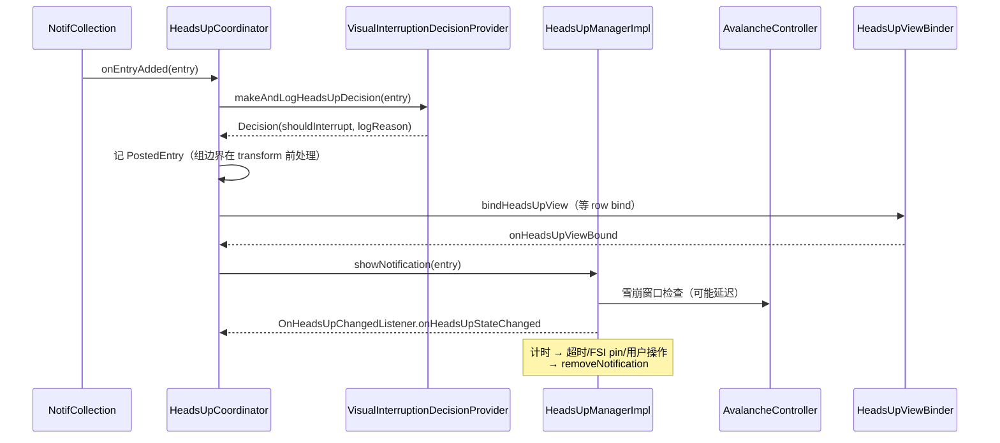

# 03 · 横幅通知（Heads-Up / HUN）

> 横幅 = 通知以悬浮条形式出现在屏幕顶部（勿扰/全屏意图等场景例外）。本篇讲「判定 → 上屏 → 超时/撤下」全链。判定入口的管道 hook 见 [01](./01-ingress-pipeline.md) §1.5，横幅态的内容槽见 [02](./02-card-and-inflate.md) §2.3。

## 3.1 视觉打断判定：VisualInterruptionDecisionProvider

17 把旧 `NotificationInterruptStateProvider` 重构为 `interruption/VisualInterruptionDecisionProvider.kt` 三层决策模型（同服务于 HUN / Bubble / FSI）：

| 层 | 类型 | 语义 | 例子 |
|---|---|---|---|
| Condition | `VisualInterruptionCondition` | 全局开关，不看具体通知 | `PeekDisabledSuppressor`（`Settings.Global.HEADS_UP_NOTIFICATIONS_ENABLED`）、`PulseDisabledSuppressor`、`PulseBatterySaverSuppressor`（电池省电）等 |
| Legacy | `NotificationInterruptSuppressor` | 旧式逐通知抑制（兼容层） | 各 subsystem 注册的 suppressor |
| Filter | `VisualInterruptionFilter` | 逐通知新式过滤 | DND（按 channel 绕过）、锁屏可见性、pocket |

产出 `Decision(shouldInterrupt, logReason)`——**每个判定都有可审计的 logReason**，排查「为什么不弹横幅」直接看 `VisualInterruptionDecisionLogger`。FSI 走 `FullScreenIntentDecisionProvider` 单独决策，区分 `wouldInterruptWithoutDnd`（被 DND 拦的 FSI 与不该弹的 FSI 分开统计/警告通知）。

## 3.2 HeadsUpCoordinator：管道侧的 HUN 大使

`collection/coordinator/HeadsUpCoordinator.kt` 在 attach 时注册：5 个管道 hook（见下）＋ `mHeadsUpManager.addListener`、action-click listener、promoted chip tap flow 收集：

```kotlin
pipeline.addCollectionListener(mNotifCollectionListener)      // entry 增删改入口
pipeline.addOnBeforeTransformGroupsListener { onBeforeTransformGroups() }
pipeline.addOnBeforeFinalizeFilterListener(::onBeforeFinalizeFilter)
pipeline.addPromoter(mNotifPromoter)                          // HUN 中的 child 提为顶层
pipeline.addNotificationLifetimeExtender(mLifetimeExtender)   // 横幅显示中 retract 不删
```

核心状态是 `PostedEntry`（每个 key 一份）：`wasAdded / wasUpdatedBy / shouldHeadsUpEver / shouldHeadsUpAgain / isFromUserAction / isHeadsUpEntry / isPinnedByUser / isBinding`。流程：

1. entry posted/updated → 调 `VisualInterruptionDecisionProvider.makeAndLogHeadsUpDecision` → 记 `PostedEntry`
2. `onBeforeTransformGroups`：**先处理无组条目的快路径**；**组边界（summary HUN 转移、child 继承）在 `onBeforeFinalizeFilter` 解**——此时 shade 列表接近 final，能按 group location（Summary/Child/Isolated/Detached）决策（`findHeadsUpOverride` / `findBestTransferChild` 等）
3. 决定弹 → 等 row bind 完（02 篇的 bind 回调）→ `HeadsUpManager.showNotification`
4. `mNotifPromoter`：HUN 中的组 child 提升为顶层（用户能直接在横幅里看到它）
5. lifetime extender：HUN 显示期间 system server retract 该通知 → 延期删除直到横幅消失

17 新增：**promoted notification chips**（状态栏小胶囊）——点 chip 触发 `onPromotedNotificationChipTapEvent`，作为 HUN 开关 toggle（`StatusBarNotificationChipsInteractor`）。

## 3.3 HeadsUpManagerImpl：横幅状态机

`headsup/HeadsUpManagerImpl.java`（实现 `HeadsUpManager` + `HeadsUpRepository`）：

- **`HeadsUpEntry`**（内部类）：每条横幅的计时状态——`mEarliestRemovalTime`（最早移除时间）、`mWasUnpinned`、`updateEntry(updateEarliestRemovalTime=true)` 更新计时并经 `scheduleAutoRemovalCallback` 重排自动移除回调（时长还经 `AvalancheController.getDuration` 调整）、sticky/pinned 标记
- `showNotification(entry, isFromUserAction)` → `createHeadsUpEntry` → 经 `mAvalancheController.update`（可能被雪崩窗口延迟）→ 入 `mHeadsUpEntryMap` + `onEntryAdded`（定 pin 状态、通知 `OnHeadsUpChangedListener`）
- `removeNotification(key, releaseImmediately, reason)`：立即或延迟；`canRemoveImmediately` 由 HeadsUpManagerImpl **自查**（是否被手动划出、是否非 top entry、用户动作豁免、是否已显示够最短时长）；「还在 bind 中」是 coordinator 侧 `isEntryBinding` 的语义
- **pin 规则**：`shouldHeadsUpBecomePinned` = 有 full-screen intent 且未被用户 unpin（来电/闹钟类横幅不自动消失）
- **snooze**：per-package 降频（`heads_up_snooze_length_ms`，用户可对某 App「冷却横幅」）
- 用户展开/收起 shade 时 `onExpandingFinished` 决定哪些横幅转列表、哪些直接撤

## 3.4 上屏与动画

- `interruption/HeadsUpViewBinder.java`：把 entry 绑到横幅宿主视图（与 row 的 `headsUpChild` 内容槽配合，02 篇）
- `NotificationTransitionAnimatorController.kt`：横幅滑入/滑出动画（与 06 篇的 launch 动画共用动画设施）
- `HeadsUpAnimationEvent` / `HeadsUpAnimator.kt`：横幅动画的**共享数值**（Y 位移，`StackScrollAlgorithm`/`StackStateAnimator` 共用保证一致）；滑入滑出的实际驱动在 `NotificationStackScrollLayout`（消费动画事件）。`HeadsUpTouchHelper`：横幅触摸手势——下滑拖出 shade、上滑 fling 收起（可触发 per-package snooze）
- `NotificationTransitionAnimatorController.kt`：**点击通知启动 App 时的共享元素转场**（`ActivityTransitionAnimator.Controller`，通知行展开成新窗口；见 06 篇 launch 动画）——不是横幅进出动画

## 3.5 AvalancheController：通知雪崩抑制

`headsup/AvalancheController.kt`（近年新增，版权 2024）：短时间内大量通知到达时**批量延迟 HUN 展示与移除**，避免横幅连环轰炸。受 `NotificationThrottleHun`（用户设置「通知冷却」）与 `AvalancheReplaceHunWhenCritical`（critical 通知到达时替换等待中的普通横幅）控制。Dev note 见类注释：调试时可关掉 suppression，避免每次构建后 2 分钟无横幅。

## 3.6 与 AOD 脉冲的衔接

息屏时 HUN 不弹屏，走 doze 脉冲链路：`NotificationAlerted` → `DozeTriggers.onNotification`（判定 `pulseOnNotificationEnabled`）→ `requestPulse` → AOD 短暂亮起（详见 [AOD 知识库](../2026-09-30-aod-knowledge-base.md) §1.5）。`NotificationWakeUpCoordinator`（`statusbar/notification/NotificationWakeUpCoordinator.kt`）的职责是**通知在 doze/唤醒过程中的可见性与 doze-amount 动画**、pulse expanding 状态同步（监听 `StatusBarStateController`/`HeadsUpManager`/shade 展开）；「是否脉冲唤醒」的决策在 `DozeTriggers`/`DozeHost`。

## 3.7 时序：一条高优先级通知弹横幅



## 3.8 本篇小结（本项目落点）

- 全部 `:SystemUI-core`：`headsup/`（16 文件）、`interruption/`（决策层）、`collection/coordinator/HeadsUpCoordinator.kt`。
- 关键 flags：`NotificationThrottleHun`、`AvalancheReplaceHunWhenCritical`、`NotificationChipFromCompactContent`（compact 横幅样式来源）。
- 排查「不弹横幅」：`dumpsys … NotifPipeline` 看 HeadsUpCoordinator 段 + `VisualInterruptionDecisionLogger`（logReason 直接给原因）+ `settings get global heads_up_notifications_enabled`。
- 与 [AOD 知识库](../2026-09-30-aod-knowledge-base.md) §3.6、本篇 §3.6 构成「亮屏弹横幅 / 息屏走脉冲」的完整二分。
