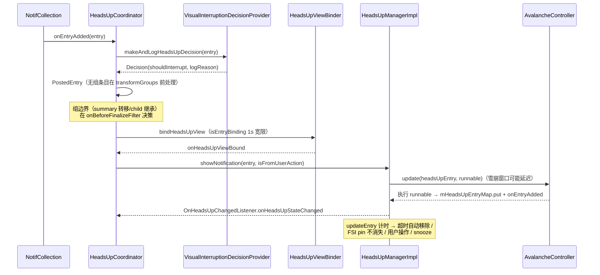

# 03 · 横幅通知（Heads-Up / HUN）

> 横幅 = 通知以悬浮条形式出现在屏幕顶部。本篇讲「判定 → 上屏 → 计时/撤下」全链。管道 hook 见 [01](./01-ingress-pipeline.md) §1.5，横幅态内容槽见 [02](./02-card-and-inflate.md) §2.3。
> 基准：AOSP `android-17.0.0_r1`；引用格式 `路径` + `类#方法`；源码摘录均已验证。

## 3.1 视觉打断判定：VisualInterruptionDecisionProvider

`interruption/VisualInterruptionDecisionProvider.kt`——17 重构后的三层决策模型（同服务 HUN/PEEK、Bubble、PULSE、FSI）：

```kotlin
interface VisualInterruptionDecisionProvider : CoreStartable {
    interface Decision { val shouldInterrupt: Boolean; val logReason: String }
    interface FullScreenIntentDecision : Decision { val wouldInterruptWithoutDnd: Boolean }
    fun addLegacySuppressor(suppressor: NotificationInterruptSuppressor)  // 旧式逐通知
    fun addCondition(condition: VisualInterruptionCondition)              // 全局开关
    fun addFilter(filter: VisualInterruptionFilter)                       // 逐通知新式
}
```

**求值顺序**：`VisualInterruptionDecisionProviderImpl#makeUnloggedHeadsUpDecision` → 逐层问 condition（不看通知）→ legacy suppressor → filter（看通知）→ 产出 `LoggableDecision(DecisionImpl(shouldInterrupt, logReason))`——**每个判定都带可审计的 logReason**（如 `"PeekDisabledSuppressor.shouldSuppress"`）。

### 3.1.1 抑制器全表（`CommonVisualInterruptionSuppressors.kt`，源码逐类核对）

| 类 | 类型 | 判定 |
|---|---|---|
| `PeekDisabledSuppressor` | Condition(PEEK) | `Settings.Global.HEADS_UP_NOTIFICATIONS_ENABLED` 关闭 |
| `PulseDisabledSuppressor` | Condition(PULSE) | pulse 被用户设置关闭 |
| `PulseBatterySaverSuppressor` | Condition(PULSE) | `batteryController.isAodPowerSave()` |
| `PeekPackageSnoozedSuppressor` | Filter(PEEK) | 该 package 被 snooze（`HeadsUpManager.isSnoozed`） |
| `PeekAlreadyBubbledSuppressor` | Filter(PEEK) | 已是 bubble |
| `PeekDndSuppressor` | Filter(PEEK) | `entry.shouldSuppressPeek()`（DND） |
| `PeekNotImportantSuppressor` | Filter(PEEK) | `entry.importance < IMPORTANCE_HIGH` |
| `PeekDeviceNotInUseSuppressor` | Condition(PEEK) | 设备不在使用中 |
| `PeekOldWhenSuppressor` | Filter(PEEK) | `Notification.when` 太旧（`MAX_HUN_WHEN_AGE_MS`） |
| `PulseEffectSuppressor` | Filter(PULSE) | `entry.shouldSuppressAmbient()` |
| `PulseLockscreenVisibilityPrivateSuppressor` | Filter(PULSE) | 锁屏隐藏可见性 |

FSI（全屏意图）走 `FullScreenIntentDecisionProvider`：独立决策矩阵（keyguard/provisioned/DND），产出 `FullScreenIntentDecision.wouldInterruptWithoutDnd`——被 DND 拦的 FSI 与根本不该弹的 FSI 分开统计（`NO_FSI_SUPPRESSED_ONLY_BY_DND` warning）。

## 3.2 HeadsUpCoordinator：管道侧的 HUN 大使

`collection/coordinator/HeadsUpCoordinator.kt`（1140 行，attach 注册 5 个 pipeline hook + `mHeadsUpManager.addListener` + action-click listener + promoted chip tap flow）：

```kotlin
// HeadsUpCoordinator#attach（hook 顺序即管道参与顺序）
pipeline.addCollectionListener(mNotifCollectionListener)      // entry 增删改入口
pipeline.addOnBeforeTransformGroupsListener { onBeforeTransformGroups() }
pipeline.addOnBeforeFinalizeFilterListener(::onBeforeFinalizeFilter)
pipeline.addPromoter(mNotifPromoter)                          // HUN 中的 child 提为顶层
pipeline.addNotificationLifetimeExtender(mLifetimeExtender)   // 横幅显示中 retract 不删
```

### 3.2.1 PostedEntry：每 key 的决策状态

```kotlin
// HeadsUpCoordinator.kt:1064（data class 全字段）
data class PostedEntry(
    val entry: NotificationEntry,
    val wasAdded: Boolean,
    val wasUpdatedBy: UpdateSource?,       // App / SystemServer / Internal
    val shouldHeadsUpEver: Boolean,
    val shouldHeadsUpAgain: Boolean,
    val isFromUserAction: Boolean,
    val isHeadsUpEntry: Boolean,
    val isPinnedByUser: Boolean,
    val isBinding: Boolean,
)
```

### 3.2.2 两级时机处理组边界

- `onBeforeTransformGroups`（buildList Step 4 前）：**快路径**——只处理 `!posted.entry.sbn.isGroup` 的无组条目（`mPostedEntries.remove`）
- `onBeforeFinalizeFilter`（Step 8 前）：**组边界决策全在这**——此时 shade 列表接近 final，能按 group location（Summary/Child/Isolated/Detached）决策：
  - `findHeadsUpOverride`：组 summary 或 child 谁该承接 HUN
  - `findBestTransferChild`：summary 被撤时把 HUN 转移给最优 child
  - `"detached-summary-remove-heads-up"` 场景：detach 的 summary 移除其 HUN
  - child 继承 parent 的 HUN（`childToReceiveParentHeadsUp` 逻辑段）

### 3.2.3 生命周期协作

- `mLifetimeExtender`（`NotifLifetimeExtender`）：HUN 显示期间 system server retract → 延期删除（`mNotifsExtendingLifetime` 记录 + 取消回调）
- `isEntryBinding`（`:1013`）：`mEntriesBindingUntil[key] = mNow + BIND_TIMEOUT`（`BIND_TIMEOUT = 1000L`）——row 还在 bind 时的 1 秒宽限
- promoted chip 点按（`onPromotedNotificationChipTapEvent`）：作为 HUN 开关 toggle（`shouldHeadsUpEver = !isCurrentlyHeadsUp`），`mNotifPromoter.invalidateList` 重跑

## 3.3 HeadsUpManagerImpl：横幅状态机

`headsup/HeadsUpManagerImpl.java`（实现 `HeadsUpManager` + `HeadsUpRepository` + `OnHeadsUpChangedListener`）。

### 3.3.1 showNotification 全链（17 实际代码）

```java
// HeadsUpManagerImpl#showNotification（核心段，源码摘录）
public void showNotification(@NonNull NotificationEntry entry, boolean isFromUserOpenAction) {
    HeadsUpEntry headsUpEntry = createHeadsUpEntry(entry);
    PinnedStatus requestedPinnedStatus = isFromUserOpenAction
            ? PinnedStatus.PinnedByUser : PinnedStatus.PinnedBySystem;
    headsUpEntry.setRequestedPinnedStatus(requestedPinnedStatus);
    Runnable runnable = () -> {
        mHeadsUpEntryMap.put(entry.getKey(), headsUpEntry);   // ArrayMap，无容量淘汰
        onEntryAdded(headsUpEntry, requestedPinnedStatus);
        updateNotificationInternal(entry.getKey(), requestedPinnedStatus);
        entry.setInterruption();
    };
    mAvalancheController.update(headsUpEntry, runnable, "showNotification");  // 可能被雪崩窗口延迟
}
```

要点：**17 没有「有序集合溢出挤最旧」**（旧版 BaseHeadsUpManager 语义已不存在）；存储是 `ArrayMap mHeadsUpEntryMap`，`compare/compareTo` 仅用于 top-entry 选择、AvalancheController 排序与 HeadsUp sectioner 排序。

### 3.3.2 计时与自动移除

- `HeadsUpEntry`（内部类）：`mEarliestRemovalTime`（最早移除时间）、`mWasUnpinned`（用户手动 unpin 过）、sticky/pinned 标记
- `updateEntry(updatePostTime, updateEarliestRemovalTime, ignoreSticky, reason)`：更新计时并 `scheduleAutoRemovalCallback(finishTimeCalculator, ...)` 重排自动移除回调（时长经 `AvalancheController.getDuration` 调整）
- `removeNotification(key, releaseImmediately, animate, reason)`：立即或延迟移除
- `canRemoveImmediately(key)` 由 HeadsUpManagerImpl **自查**：`mSwipedOutKeys`（手动划出）/ 非 top entry / `mUserActionMayIndirectlyRemove` / `wasShownLongEnough() || isRowDismissed()`——「还在 bind 中」的判断在 coordinator 侧（`isEntryBinding`）

### 3.3.3 pin 与 snooze

```java
// HeadsUpManagerImpl#shouldHeadsUpBecomePinned
boolean shouldHeadsUpBecomePinned(@Nullable NotificationEntry entry) {
    ...
    return hasFullScreenIntent(entry) && !headsUpEntry.mWasUnpinned;
}
```

- **pin**：有 full-screen intent 且用户没 unpin 过 → 不自动消失（来电/闹钟）
- **snooze**：per-package 降频（`SETTING_HEADS_UP_SNOOZE_LENGTH_MS = "heads_up_snooze_length_ms"`）；`isSnoozed(packageName)` 被 `PeekPackageSnoozedSuppressor` 消费
- `onExpandingFinished`：用户收起 shade 后决定哪些横幅转列表、哪些撤下

## 3.4 上屏与动画

| 组件 | 机制 |
|---|---|
| `interruption/HeadsUpViewBinder.java` | 把 entry 绑到横幅宿主视图（与 row 的 `headsUpChild` 槽配合，02 篇 §2.3 的 `FLAG_CONTENT_VIEW_HEADS_UP`）；bind 完回调 `HeadsUpCoordinator#onHeadsUpViewBound` → `showNotification` |
| `HeadsUpAnimationEvent` / `headsup/HeadsUpAnimator.kt` | 横幅动画的**共享数值**（Y 位移，`StackScrollAlgorithm`/`StackStateAnimator` 共用保证一致）；滑入滑出实际驱动在 `NotificationStackScrollLayout`（消费动画事件，04 篇） |
| `NotificationTransitionAnimatorController.kt` | **点击通知启动 App 的共享元素转场**（`ActivityTransitionAnimator.Controller`，通知行展开成新窗口；→ [06 篇](./06-interaction.md) §6.3）——不是横幅进出动画 |
| `HeadsUpTouchHelper` | 横幅触摸手势：下滑拖出 shade、上滑 fling 收起（`notifyFling` 可触发 per-package snooze） |
| `HeadsUpManagerExt.kt` | StateFlow 化扩展（`isTrackingHeadsUp` 等） |

## 3.5 AvalancheController：雪崩抑制

`headsup/AvalancheController.kt`（近年新增，版权 2024）——短时间大量通知到达时**批量延迟 HUN 展示与移除**：

- `update(headsUpEntry, runnable, reason)` 是 showNotification 的唯一入口（§3.3.1）——雪崩窗口内攒延迟
- `getDuration` 调整 `HeadsUpEntry` 显示时长
- 受 `NotificationThrottleHun`（用户「通知冷却」设置）与 `AvalancheReplaceHunWhenCritical`（critical 通知到达时替换等待中的普通横幅）两个 flag 控制
- `enableAtRuntime` 关闭时 waiting 的 HUN 转入 open shade 的 HUN section
- Dev note（类注释）：调试时关 suppression，避免每次构建后 2 分钟无横幅（`Settings > Notifications > General > Notification cooldown`）

## 3.6 与 AOD 脉冲的二分

息屏时 HUN 不弹屏，走 doze 脉冲链路（详见 [AOD 知识库](../2026-09-30-aod-knowledge-base.md) §1.5）：

- `NotificationAlerted` → `DozeTriggers.onNotification`（判 `pulseOnNotificationEnabled` + AOD 未抑制）→ `requestPulse(PULSE_REASON_NOTIFICATION)` → AOD 短暂亮起
- `NotificationWakeUpCoordinator`（`statusbar/notification/NotificationWakeUpCoordinator.kt`）：**通知在 doze/唤醒过程中的可见性与 doze-amount 动画**、pulse expanding 状态同步（监听 `StatusBarStateController`/`HeadsUpManager`/shade 展开）——不是「要不要唤醒」的决策器，那在 `DozeTriggers`/`DozeHost`

## 3.7 时序：高优先级通知弹横幅



## 3.8 本篇小结（本项目 Gradle 落点）

- 全部 `:SystemUI-core`：`headsup/`（16 文件）、`interruption/`（决策层）、`collection/coordinator/HeadsUpCoordinator.kt`（1140 行）。
- 关键 flags：`NotificationThrottleHun`、`AvalancheReplaceHunWhenCritical`、`NotificationChipFromCompactContent`（compact 横幅样式来源）。
- 排查「不弹横幅」：`dumpsys … NotifPipeline` 看 HeadsUpCoordinator 段（PostedEntry 全表）+ logcat 的 `VisualInterruptionDecisionLogger`（logReason 直接给原因）+ `settings get global heads_up_notifications_enabled`。
- 与 [AOD 知识库](../2026-09-30-aod-knowledge-base.md) §3.6、本篇 §3.6 构成「亮屏弹横幅 / 息屏走脉冲」的完整二分。
