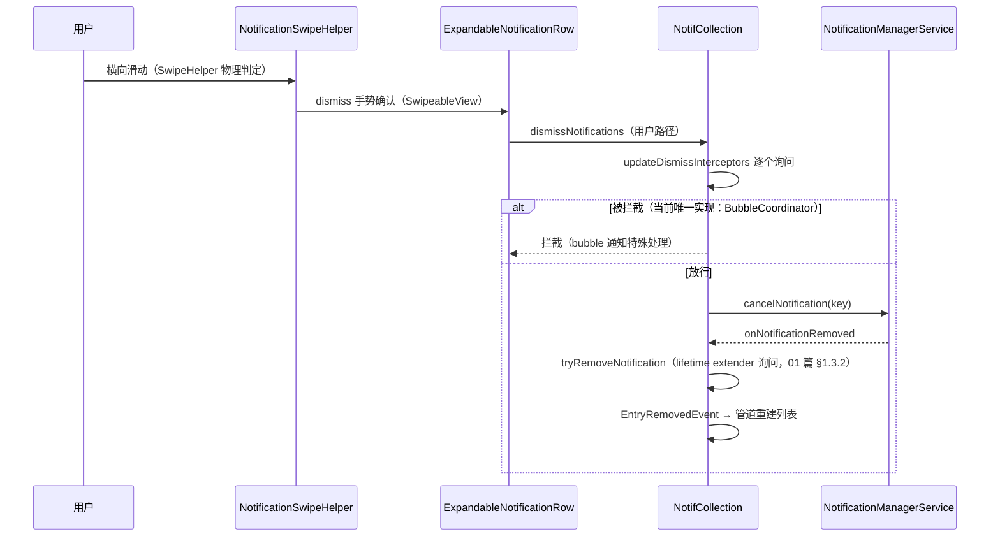

# 06 · 交互与动画（点击 / 滑动 / 回复 / 设置面板）

> 通知卡片的用户交互全谱。卡片结构见 [02](./02-card-and-inflate.md)，列表手势宿主见 [04](./04-shade-list.md)。
> 基准：AOSP `android-17.0.0_r1`；引用格式 `路径` + `类#方法`；源码摘录均已验证。

## 6.1 点击与启动

### 6.1.1 NotificationClicker：点击的防重闸门

`statusbar/notification/NotificationClicker.java`——在 `NotificationRowBinderImpl#updateRow` 时 `register(row, sbn)` 把 content intent 绑到 row 的点击。`onClick` 的**四项防重检查**（源码摘录）：

```java
// NotificationClicker#onClick（核心段）
public void onClick(final View v) {
    ...
    mPowerInteractor.wakeUpIfDozing("NOTIFICATION_CLICK", PowerManager.WAKE_REASON_GESTURE);
    final ExpandableNotificationRow row = (ExpandableNotificationRow) v;
    mLogger.logOnClick(row.getLoggingKey());

    if (isMenuVisible(row)) {                       // 1. 滑动菜单展开中
        row.animateResetTranslation(); return;
    } else if (row.isChildInGroup() && isMenuVisible(row.getNotificationParent())) {  // 2. 父菜单
        row.getNotificationParent().animateResetTranslation(); return;
    } else if (row.isSummaryWithChildren() && row.areChildrenExpanded()) {            // 3. 组展开中
        return;   // 组展开时不直接开 app
    } else if (row.areGutsExposed()) {               // 4. guts 面板展开中
        return;
    }
    row.setJustClicked(true);
    DejankUtils.postAfterTraversal(() -> row.setJustClicked(false));
    row.getEntryAdapter().onEntryClicked(row);
}
```

**误触判定不在这里**——`row/ActivatableNotificationViewController.java` 的 `TouchHandler`（`FalsingManager.isFalseTap` 触摸延迟/手势误触检测）在更早的触摸分发层拦截。

### 6.1.2 StatusBarNotificationActivityStarter：真正的启动决策

`NotificationActivityStarter.kt` 是接口；实现 `statusbar/phone/StatusBarNotificationActivityStarter.java`（`onNotificationClicked` `:282`）：

```java
// StatusBarNotificationActivityStarter（启动决策骨架）
public void onNotificationClicked(@NonNull NotificationEntry entry, ...) {
    ...
    mActivityStarter.dismissKeyguardThenExecute(        // :375 解锁检查（keyguard dismiss）
        onDismissAction, null, ...);
}
private int sendPendingIntent(...) {                    // :566
    // 经 ActivityStarter 发 contentIntent PendingIntent
    // FSI/全屏场景与 keyguard occluded 的交互也走此入口
}
```

启动链：`onEntryClicked` → `onNotificationClicked` → keyguard dismiss（未解锁时先解锁再执行）→ `sendPendingIntent`（异步，带 dismiss 回调 `onDismissAction`）→ 状态栏收起。启动日志在 `NotificationClickerLogger`。

`ActivityStartOptions` 在 `:SystemUI-plugin`（供其他启动路径使用，与本类无引用关系）。

## 6.2 滑动与 Dismiss

### 6.2.1 SwipeHelper 框架

`com/android/systemui/SwipeHelper.java`（core 根包，`implements Gefingerpoken, Dumpable`）——滑动框架基类：拖拽物理、方向判定、fling 甩动阈值、`onInterceptTouchEvent`（`:321`）。**当前镜像中唯一消费者**是 `stack/NotificationSwipeHelper.java`（`extends SwipeHelper implements NotificationSwipeActionHelper`，通知栈滑动特化：dismiss/滑出按钮/滑动菜单）。

`ExpandableNotificationRow implements SwipeableView`：把自己交给 `NotificationSwipeHelper`；滑动露出 dismiss/设置按钮（`AnimatedActionBackgroundDrawable`/`AnimatedActionButton`，[02 篇](./02-card-and-inflate.md) §2.7）。

### 6.2.2 Dismiss 数据流



- 滑出登记：`HeadsUpManager.addSwipedOutNotification(key)`（`mSwipedOutKeys`）——手动划出的横幅不再自动移除（[03 篇](./03-heads-up.md) §3.3.2）
- 「清除全部」走 `FooterView` 的 ClearAllButton（[04 篇](./04-shade-list.md) §4.5）→ 批量 dismiss

## 6.3 Launch Animation（点击后的展开动画）

`statusbar/notification/NotificationTransitionAnimatorController.kt`——**点击通知启动 App 时的共享元素转场**（`ActivityTransitionAnimator.Controller`，通知行展开成新窗口）：

- `createTransitionController`：动画状态机（`isLaunching` 时冻结 row 内容防变化破坏动画）
- `LaunchAnimationParameters.kt`：动画参数——源 row 的屏幕位置（top/bottom/left/right）、上下圆角、translationZ、clip 量、progress（`extends TransitionAnimator.State`；无图标参数）
- 与桌面/启动器的 `LaunchAnimator` 协作接口在 `:SystemUI-plugin` 的 `ActivityStarter` 体系
- 动画期间 row 状态冻结，完成后释放——「点通知跳应用时那团平滑放大」就是它

## 6.4 Remote Input（内联回复）

### 6.4.1 结构

| 组件 | 位置 | 职责 |
|---|---|---|
| `RemoteInputView.java` + `RemoteInputViewController.kt` | `statusbar/policy/` | 回复框 UI（收缩在 expanded/headsUp 槽内，[02 篇](./02-card-and-inflate.md) 的 `mExpandedRemoteInput`）；dagger 模块 `row/dagger/RemoteInputViewModule`（`@RemoteInputViewScope`） |
| `RemoteInputController.java` | `statusbar/` | 并发管理（见下） |
| `NotificationRemoteInputManager.java` | `statusbar/` | 生命周期挂接（`bindRow` `:704`；`isSpinning` `:725`） |
| `RemoteInputCoordinator.kt` | `collection/coordinator/` | 管道侧 lifetime extend（回复发送中通知不删） |

### 6.4.2 RemoteInputController 的并发管理

```java
// RemoteInputController.java（关键 API）
public void addRemoteInput(RemoteInputEntryAdapter entry, Object token, ...)   // :77
public void removeSpinning(String key)                  // :209 发送完成
public boolean isSpinning(String key)                   // :224 发送中（key 维度）
public boolean isSpinning(String key, Object token)     // :234 token 匹配验证
public void closeRemoteInputs()                         // :351 触摸外部关闭
```

「同一时刻只有一个回复框展开」由两层维持：`NotificationContentView.transferRemoteInputFocus` 的 `stealFocusFrom`（HUN↔expanded 槽互斥）+ 触摸外部 `closeRemoteInputs`；**发送中（spinning）按 key 跟踪**——spinning 期间该 entry 的图标显示发送中状态，且 `RemoteInputCoordinator` 对它 lifetime extend（`addNotificationLifetimeExtender`，[01 篇](./01-ingress-pipeline.md) §1.3.2）。

### 6.4.3 发送完成链

`NotificationRemoteInputManager` 的 `onRemoteInputSent(entry)`（`:344`）→ `removeSpinning` → 解除 lifetime extend。智能回复（smart reply）视图在 inflate 阶段附加（[02 篇](./02-card-and-inflate.md) §2.4.1 的 `inflateSmartReplyViews`）。

## 6.5 长按：Guts 与 Snooze

### 6.5.1 NotificationGutsManager

`row/NotificationGutsManager.java`——长按弹出的操作面板（通知渠道、静音、关闭、设置入口）：

- 打开/关闭：`openGuts`/`closeGuts` 状态机（与 `NotificationClicker` 的 `areGutsExposed` 防重联动，§6.1.1）
- 各类型 guts 内容：`NotificationInfo`（通用）、`PartialConversationInfo`（对话）、`BundleHeaderGutsContent`（17 bundle 的 guts，消费 `BundleEntryAdapter`）、`PromotedNotificationInfo`、`PromotedPermissionGutsContent`
- `ChannelEditorDialogController.kt`：渠道编辑对话框
- 插件点：`NotificationMenuRowPlugin`（滑动菜单行可被插件替换，见[插件化知识库](../2026-09-30-systemui-plugin-knowledge-base.md) §5.3）

### 6.5.2 NotificationSnooze

`row/NotificationSnooze.java`——「稍后提醒」：选时长（分钟/小时/自定义）→ `HeadsUpManager` per-package snooze（[03 篇](./03-heads-up.md) §3.3.3）+ NMS 侧 snooze → 通知从列表消失，到期 NMS 重新 post（走正常管道）。横幅上滑 fling 收起也可触发 snooze（`HeadsUpTouchHelper#notifyFling`，[03 篇](./03-heads-up.md) §3.4）。

## 6.6 本篇小结（本项目 Gradle 落点）

- 全部 `:SystemUI-core`：`statusbar/notification/Notification{Clicker,ActivityStarter}.kt(java)`、`statusbar/phone/StatusBarNotificationActivityStarter.java`、`SwipeHelper`（core 根）、`stack/NotificationSwipeHelper.java`、`statusbar/policy/RemoteInput*`、`statusbar/RemoteInputController.java`、`NotificationGuts*`、`NotificationSnooze`。
- 插件接缝：`NotificationMenuRowPlugin`、`NotificationListenerController`（[插件化知识库](../2026-09-30-systemui-plugin-knowledge-base.md) §5.3）。
- 排查：点击无响应看 `NotificationClickerLogger`（logOnClick/防重原因四选一）；回复框冲突看 `RemoteInputController` dump（spinning 状态）；滑不掉看 `NotificationSwipeHelper` 与 dismiss interceptor 链（`dumpsys … NotifPipeline` collection 段）。
