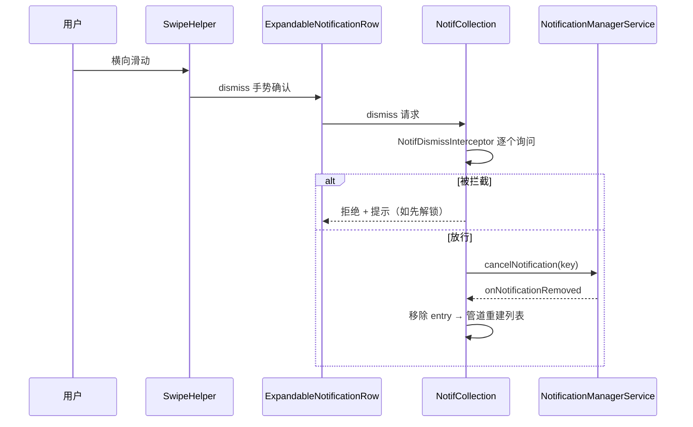

# 06 · 交互与动画（点击 / 滑动 / 回复 / 设置面板）

> 通知卡片的用户交互全谱。卡片结构见 [02](./02-card-and-inflate.md)，列表手势宿主见 [04](./04-shade-list.md) §4.7。

## 6.1 点击与启动

- `statusbar/notification/NotificationClicker.java`：在 `NotificationRowBinderImpl#updateRow` 时 `register(row, sbn)` 把 content intent 绑到 row 的点击；负责点击防重（菜单展开、组内子通知展开、guts 展开时不触发）与日志。**误触判定（`FalsingManager.isFalseTap` 触摸延迟等）在 `row/ActivatableNotificationViewController` 的 TouchHandler**
- `NotificationActivityStarter`（接口，实现类 `statusbar/phone/StatusBarNotificationActivityStarter.java`）：真正的启动决策——收起 shade / 解锁检查（keyguard dismiss）/ 调 `PendingIntent.send`；FSI/全屏场景与 keyguard occluded 的交互也走此入口（`ActivityStartOptions` 在 `:SystemUI-plugin`，由其他启动路径使用，与本类无引用关系）
- FSI/全屏场景与 keyguard occluded 的交互也走此入口

## 6.2 滑动与 Dismiss

- `com.android.systemui.SwipeHelper`（core 根包）：滑动框架基类；当前镜像中唯一消费者是 `stack/NotificationSwipeHelper`（通知栈滑动）
- `ExpandableNotificationRow` 实现 `SwipeableView`：把自己交给 SwipeHelper；滑动露出 dismiss/设置按钮（AnimatedActionBackgroundDrawable/AnimatedActionButton，02 篇 §2.6）
- Dismiss 数据流：
  1. 用户滑掉/点清除 → row 动画移除
  2. `NotifCollection` 收到 dismiss → **先过 `NotifDismissInterceptor`**（01 篇 §1.3；本镜像中唯一注册实现是 `BubbleCoordinator`，拦截 bubble 通知的 dismiss）
  3. 放行 → `NotificationManager.cancelNotification`（回流 framework）→ NMS 回发 onNotificationRemoved → 管道移除
- 「清除全部」走 `FooterView`（04 篇）→ 批量 dismiss

## 6.3 Launch Animation（点击后的展开动画）

- `NotificationTransitionAnimatorController.kt`：通知 → 应用窗口的共享元素展开动画控制器（与桌面/启动器的 `LaunchAnimator` 协作）
- `LaunchAnimationParameters.kt`：动画参数（源 row 的屏幕位置/圆角/裁剪与进度参数，继承 `TransitionAnimator.State`）
- 动画期间 row 状态冻结（防止内容变化破坏动画），完成后 row 释放——「点通知跳应用时那一团平滑放大」就是它

## 6.4 Remote Input（内联回复）

- `statusbar/policy/RemoteInputView.java` + 同包 `RemoteInputViewController.kt`（dagger 模块 `row/dagger/RemoteInputViewModule`，`@RemoteInputViewScope`）：通知里的**内联回复框 UI**（收缩在 expanded/headsUp 内容槽里，02 篇的 `mExpandedRemoteInput`）
- `statusbar/RemoteInputController.java`：**并发管理**——同一时刻只允许一个回复框展开（按 key 跟踪），处理发送中/失败重试状态
- `NotificationRemoteInputManager`：把 RemoteInput 生命周期挂到 row 绑定（`bindRow`，02 篇）
- 管道侧：`RemoteInputCoordinator`（01 篇 §1.5）——回复中的 entry **lifetime extend**（通知被 retract 也不消失，直到发送完成）；`RemoteInputEntryAdapter`/`RemoteInputControllerLogger` 辅助
- 免打扰回复（smart reply）在 `inflateSmartReplyViews`（02 篇 §2.4）附加

## 6.5 长按：Guts 与 Snooze

- `NotificationGutsManager` + `row/NotificationGuts.java`：长按弹出的操作面板（通知渠道、静音、关闭、设置入口）；`NotificationInfo` / `PartialConversationInfo` / `BundleHeaderGutsContent`（17 新增 bundle 的 guts）是各类型 guts 内容
- `NotificationSnooze.java`：「稍后提醒」UI 与逻辑（选时长 → snooze 后通知从列表消失，到期 NMS 重新 post）
- `ChannelEditorDialogController.kt`：渠道编辑对话框
- `NotificationMenuRowPlugin`（插件点，见插件化知识库 §5.3）：菜单行可被插件替换

## 6.6 时序：用户滑掉一条通知

## 6.7 本篇小结（本项目落点）

- 全部 `:SystemUI-core`：`statusbar/notification/Notification{Clicker,ActivityStarter}.kt(java)`、`SwipeHelper`（core 根）、`row/RemoteInput*`、`RemoteInputController`、`NotificationGuts*`、`NotificationSnooze`。
- 插件接缝：`NotificationMenuRowPlugin`、`NotificationListenerController`（可拦截通知回调，插件化知识库 §5.3）。
- 排查：点击无响应看 `NotificationClickerLogger`；回复框冲突看 `RemoteInputController` dump；滑不掉看 dismiss interceptor 链（`dumpsys … NotifPipeline` 的 collection 段）。
